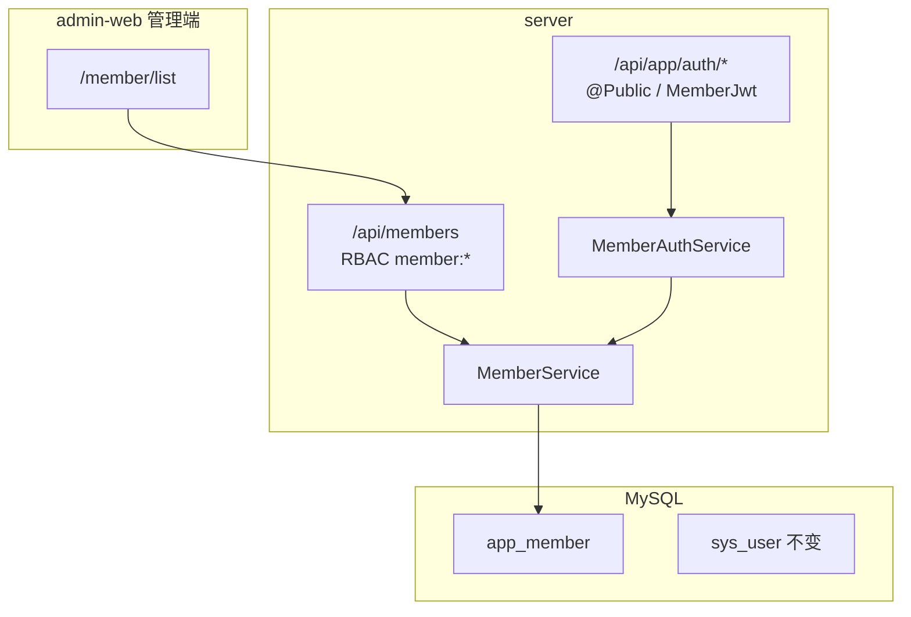

# C 端用户管理方案

## 1. 目标与边界

**目标**：在管理后台内运营 C 端（终端）用户，并提供可供未来 H5/App 调用的注册登录 API。

**已确认**：

- 范围：后台 CRUD + C 端认证 API（本期不建 C 端前端项目）
- 身份：完全独立新表 `app_member`，与 `sys_user` 无关联

**不做（本期）**：

- 短信/邮箱验证码
- C 端钱包登录
- 会员等级、积分、标签体系
- 新建 `user-web` 前端仓库

## 2. 架构概览



## 3. 与后台用户分工

| 维度 | 后台用户 `sys_user` | C 端用户 `app_member` |
|------|---------------------|------------------------|
| 用途 | 登录 admin-web、RBAC | 未来 C 端 App/H5 登录 |
| 组织 | 部门、岗位、角色 | 无 RBAC |
| 管理入口 | 系统管理 → 系统用户 | 用户管理 → 会员用户 |
| API 前缀 | `/api/users`、`/api/auth` | `/api/members`（管理）、`/api/app/auth`（C端） |
| Token | JWT `type: admin` + `permissions[]` | JWT `type: member`，无权限码 |
| Refresh Cookie | `refresh_token` | `member_refresh_token` |

## 4. 数据模型

表：`app_member`  
实体：`server/src/modules/member/entities/member.entity.ts`  
迁移：`server/scripts/app-member.sql`

| 字段 | 类型 | 说明 |
|------|------|------|
| `id` | int PK | |
| `phone` | varchar(20) nullable, unique | 手机号（与 email 至少填一） |
| `email` | varchar(100) nullable, unique | 邮箱 |
| `password` | varchar(100) | bcrypt，`select: false` |
| `nickname` | varchar(50) nullable | 昵称 |
| `avatar` | varchar(500) nullable | 头像 URL |
| `status` | tinyint | 1 启用 / 0 禁用 |
| `registerSource` | varchar(20) | `app` / `admin` / `h5` |
| `lastLoginAt` | datetime nullable | |
| `lastLoginIp` | varchar(50) nullable | |
| `createdAt` / `updatedAt` / `deletedAt` | | 继承 `BaseEntity`，软删 |

## 5. 后端模块

```
server/src/modules/member/
├── member.module.ts
├── entities/member.entity.ts
├── member.service.ts
├── dto/member.dto.ts
├── admin/member-admin.controller.ts      # /api/members
└── app/
    ├── member-auth.controller.ts         # /api/app/auth
    ├── member-auth.service.ts
    ├── dto/member-auth.dto.ts
    ├── strategies/member-jwt.strategy.ts
    └── guards/member-jwt.guard.ts
```

`AppModule` 与 `BaseModule` 并列引入 `MemberModule`。

## 6. API 清单

### 6.1 管理端（后台 JWT + RBAC）

| 方法 | 路径 | 权限码 | 说明 |
|------|------|--------|------|
| GET | `/api/members` | `member:list` | 分页；`keyword` 模糊搜索手机/邮箱/昵称 |
| GET | `/api/members/:id` | `member:list` | 详情 |
| POST | `/api/members` | `member:create` | 管理员创建（`registerSource=admin`） |
| PUT | `/api/members/:id` | `member:update` | 改昵称/头像/手机/邮箱/状态 |
| DELETE | `/api/members/:id` | `member:delete` | 软删 |
| POST | `/api/members/:id/reset-password` | `member:reset-password` | 管理员重置密码 |

### 6.2 C 端认证

| 方法 | 路径 | 鉴权 | 说明 |
|------|------|------|------|
| POST | `/api/app/auth/register` | Public | 手机或邮箱 + 密码 + 可选昵称 |
| POST | `/api/app/auth/login` | Public | 账号 + 密码 |
| POST | `/api/app/auth/refresh` | Cookie | 用 `member_refresh_token` 刷新 |
| POST | `/api/app/auth/logout` | MemberJwt | 清除 Redis refresh + Cookie |
| GET | `/api/app/auth/me` | MemberJwt | 当前会员资料 |
| PUT | `/api/app/auth/profile` | MemberJwt | 改昵称/头像 |
| PUT | `/api/app/auth/password` | MemberJwt | 改密码（验旧密码） |

## 7. JWT 双轨隔离

**后台 Token**：签发时 `type: 'admin'`；`JwtStrategy` 拒绝 `type === 'member'`；无 `type` 的旧 Token 视为 admin。

**C 端 Token**：`{ sub, type: 'member', account }`；`MemberJwtStrategy` + `MemberJwtGuard` 仅挂在 `/api/app/*` 非 Public 接口。

**前端**：`admin-web/src/utils/request.ts` 的 `isPublicAuthRequest` 已排除 `/app/auth/login`、`/app/auth/register`，避免 C 端 401 误触发后台 refresh。

## 8. 权限与菜单

RBAC 种子（`rbac-seed.service.ts`）：

- `member:list`、`member:create`、`member:update`、`member:delete`、`member:reset-password`
- 一级菜单「用户管理」→ 子菜单「会员用户」`/member/list`
- `admin` 角色默认授予上述权限

## 9. 配置项

`server/src/config/configuration.ts`：

```typescript
member: {
  jwtAccessExpiresIn: process.env.MEMBER_JWT_ACCESS_EXPIRES_IN ?? '7d',
  jwtRefreshExpiresIn: process.env.MEMBER_JWT_REFRESH_EXPIRES_IN ?? '30d',
  refreshCookieName: 'member_refresh_token',
},
```

可与后台 JWT 共用 `JWT_SECRET`，靠 `type` 字段隔离。

## 10. 登录失败锁定

复用 `LoginLockoutService`，scope 为 `'member'`，Redis key 前缀 `member-login-*`，与后台锁定计数独立。

## 11. 前端 admin-web

| 文件 | 说明 |
|------|------|
| `admin-web/src/api/member.ts` | 类型 + CRUD API |
| `admin-web/src/pages/member/list/index.tsx` | 列表页（参照系统用户精简版） |
| `admin-web/src/router/index.tsx` | 懒加载路由 `member/list` |

## 12. 验收标准

- [x] 管理员在「会员用户」页可创建、编辑、禁用、重置密码、软删除会员
- [x] `POST /api/app/auth/register` 可用手机或邮箱注册
- [x] `POST /api/app/auth/login` 返回 `accessToken` + 设置 `member_refresh_token` Cookie
- [x] 后台 Token 无法访问 `/api/app/auth/me`；C 端 Token 无法访问 `/api/members`
- [x] C 端禁用用户登录返回 `MEMBER_DISABLED`
- [x] 连续密码错误触发 member 维度锁定
- [x] `npm run build`（server + admin-web）通过

## 13. 后续增强（P1+）

- 短信/邮箱验证码注册
- [x] C 端登录日志扩展 `sys_login_log.user_type`（`admin` / `member`）
- [x] 会员导出 CSV（`GET /api/members/export`）
- [x] Dashboard 会员总数统计
