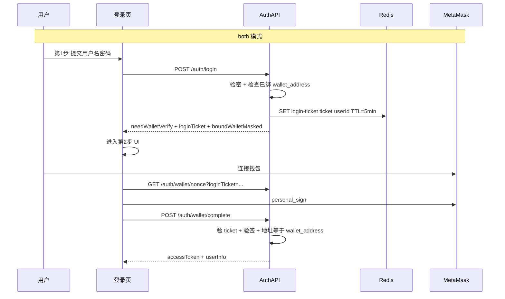

# Web3 钱包用户绑定与签名登录 — 需求与实现方案

> 本文档为 Web3 钱包登录功能的完整需求梳理与实现说明。接口摘要见 [技术方案文档.md](./技术方案文档.md) §7.1。

**实现状态（P0）**：已完成核心功能（后端 API、站点配置、登录页三种模式、系统用户绑定/解绑）。P1/P2 见 §11。

---

## 1. 背景与目标

当前系统认证为**用户名 + 密码 → JWT（Access body + Refresh HttpOnly Cookie）**，用户模型见 `server/src/modules/base/user/entities/user.entity.ts`。

**目标**：在不大改现有认证架构的前提下，实现：

1. **管理员绑定**：在「系统用户」页为目标用户填写/绑定 EVM 钱包地址
2. **钱包登录**：已绑定且启用的用户，可在登录页用 MetaMask 等 EVM 钱包签名登录
3. **登录方式可配置**：管理员在「系统设置」中选择全站登录模式（三选一，语义见 §3.1）

**已确认范围**：

| 项 | 约定 |
|----|------|
| 用户范围 | 仅管理员在「系统用户」页绑定，个人中心不提供自助绑定 |
| 链类型 | 仅 EVM（MetaMask 等注入钱包） |
| 登录模式 | `password` / `wallet` / `both`（双重验证，非二选一） |
| 登录链 | 系统设置可选 `walletChainId`，钱包登录须在对应链签名 |
| 不支持 | 未注册钱包自动开户、Solana/非 EVM 链 |

---

## 2. 角色与用例

| 角色 | 用例 |
|------|------|
| 超级管理员/有权限管理员 | 在系统用户列表绑定/解绑钱包；在系统设置选择登录方式与链 |
| 已绑定钱包的后台用户 | `wallet` 模式：钱包签名直接登录；`both` 模式：密码通过后还需用**已绑定地址**签名 |
| 未绑定钱包的用户 | `password` 模式可密码登录；`wallet` 不可用；`both` 模式密码通过后第二步失败 |
| 系统 | 按 `loginMode` 控制登录页 UI 与 auth 接口；记录登录日志 |

---

## 3. 登录方式系统配置

### 3.1 三种模式（`both` = 双重验证，非二选一）

存储在 `server/data/site.setting.json`，字段名 `loginMode`：

| 值 | 显示名 | 含义 | 登录页 UI |
|----|--------|------|-----------|
| `password` | 账户密码登录 | 仅验用户名密码（**默认**） | 单步：密码表单 |
| `wallet` | 钱包登录 | 仅验钱包签名 | 单步：连接钱包 |
| `both` | 账户密码 + 钱包 | **先密码、后钱包**，两步都通过才签发 Token | 两步向导 |

**`both` 与另外两种的区别**：

- `password` / `wallet`：单一因子，验证成功即登录
- `both`：`POST /auth/login` 只返回短期 `loginTicket` + `boundWalletMasked`，**不签发 JWT**；须 `POST /auth/wallet/complete` 验签后才签发 Token
- `both` 模式下单独调用 `POST /auth/wallet/login` **拒绝**



### 3.2 配置存储与公开读取

`SiteSettingData` / `SiteSettingVo` 扩展字段：

```typescript
loginMode: 'password' | 'wallet' | 'both';  // 默认 'password'
walletChainId: number;                       // 默认 11155111（Sepolia）
walletChainName?: string;                    // 由预设表派生
```

- **读取**：`GET /api/settings/site`（`@Public()`），登录页经 `useSiteStore` 消费
- **修改**：`PUT /api/settings/site`（需 `setting:update`），系统设置页配置

### 3.3 登录链配置

**预设链白名单**（`server/src/modules/base/setting/evm-chains.ts`）：

| chainId | 名称 | 典型用途 |
|---------|------|----------|
| `1` | Ethereum Mainnet | 生产 |
| `11155111` | Sepolia | 测试（开发默认） |
| `56` | BNB Smart Chain | 生产 |
| `137` | Polygon | 生产 |
| `42161` | Arbitrum One | 生产 |

**签名消息模板**：

```
欢迎登录 {siteName}
链: {chainName} (chainId: {chainId})
地址: {address}
Nonce: {randomNonce}
签发时间: {isoTimestamp}
```

### 3.4 保存校验（防锁死）

切换 `wallet` / `both` 前须至少 **1 名启用用户**已绑定钱包，否则保存失败（`WALLET_NO_BOUND_USER`）。

### 3.5 后端拦截（双保险）

| 接口 | `password` | `wallet` | `both` |
|------|------------|----------|--------|
| `POST /auth/login` | 验密 → 签发 JWT | 拒绝 | 验密 → 返回 `loginTicket` |
| `GET /auth/wallet/nonce` | 拒绝 | 允许 | 允许（带 `loginTicket`） |
| `POST /auth/wallet/login` | 拒绝 | 验签 → JWT | **拒绝** |
| `POST /auth/wallet/complete` | 拒绝 | 拒绝 | 验 ticket + 验签 → JWT |

**`both` 模式补充**：

- 未绑钱包 → 第 1 步返回 `WALLET_NOT_BOUND_FOR_USER`
- 地址不一致 → `WALLET_ADDRESS_MISMATCH`；**不销毁 loginTicket**，可换钱包重试
- 密码步成功响应含 `boundWalletMasked`，供第 2 步 UI 展示

### 3.6 应急兜底

环境变量 `AUTH_PASSWORD_LOGIN_FALLBACK=true` 时，始终允许密码登录（运维兜底，不暴露于 UI）。

---

## 4. 核心业务流程

### 4.1 管理员绑定钱包

- 入口：系统用户页「绑定钱包」/「换绑」/「解绑」（权限 `user:bind-wallet`）
- 地址全局唯一，EIP-55 checksum 存储
- 绑定时不要求当场签名；`wallet_bound_at` / `wallet_bound_by` 审计

### 4.2 钱包单因子登录（`wallet` 模式）

连接钱包 → 切链 → 拉 nonce → `personal_sign` → `POST /auth/wallet/login` → JWT。

### 4.3 密码 + 钱包双重验证（`both` 模式）

见 §3.1。前端第 2 步展示绑定地址、步骤提示；地址不匹配时红色 Alert 对比当前/绑定钱包。

---

## 5. 数据模型变更

`sys_user` 新增字段（迁移：`server/scripts/web3-wallet.sql`）：

| 字段 | 类型 | 说明 |
|------|------|------|
| `wallet_address` | `varchar(42)` nullable, unique | EVM 地址 |
| `wallet_bound_at` | `datetime` nullable | 绑定时间 |
| `wallet_bound_by` | `int` nullable | 操作人 userId |

---

## 6. API 设计

### 6.1 认证（`@Public()`）

| 方法 | 路径 | 描述 |
|------|------|------|
| GET | `/api/auth/wallet/nonce` | 获取签名消息 |
| POST | `/api/auth/wallet/login` | 仅 `wallet` 模式 |
| POST | `/api/auth/wallet/complete` | 仅 `both` 模式 |
| POST | `/api/auth/login` | `password` 返回 Token；`both` 返回 ticket |

**`both` 模式登录响应**：

```typescript
{
  needWalletVerify: true,
  loginTicket: string,
  expiresAt: string,
  boundWalletMasked: string  // 如 0x1234...abcd
}
```

**错误码**：

| errorCode | 场景 |
|-----------|------|
| `WALLET_NOT_BOUND` | 地址未绑定用户 |
| `WALLET_NOT_BOUND_FOR_USER` | 账号未绑钱包 |
| `WALLET_ADDRESS_MISMATCH` | 签名地址与绑定地址不一致 |
| `LOGIN_TICKET_INVALID` | ticket 无效或过期 |
| `LOGIN_MODE_PASSWORD_DISABLED` | 仅允许钱包登录 |
| `LOGIN_MODE_WALLET_DISABLED` | 不允许钱包接口 |
| `WALLET_CHAIN_MISMATCH` | chainId 与系统配置不一致 |
| `WALLET_CHAIN_UNSUPPORTED` | chainId 不在白名单 |
| `WALLET_NO_BOUND_USER` | 切换登录模式时无已绑用户 |

### 6.2 站点设置

| 方法 | 路径 | 描述 |
|------|------|------|
| GET | `/api/settings/site` | 含 `loginMode`、`walletChainId`、`walletChainName` |
| PUT | `/api/settings/site` | 更新登录方式与链 |
| GET | `/api/settings/chains` | EVM 链白名单 |

### 6.3 用户钱包

| 方法 | 路径 | 权限 | 描述 |
|------|------|------|------|
| PUT | `/api/users/:id/wallet` | `user:bind-wallet` | 绑定/换绑 |
| DELETE | `/api/users/:id/wallet` | `user:bind-wallet` | 解绑 |

---

## 7. 权限种子

- `user:bind-wallet` — 绑定/解绑用户钱包（`rbac-seed.service.ts`，admin 默认拥有）

---

## 8. 前端改动点

| 模块 | 路径 | 说明 |
|------|------|------|
| 系统设置 | `admin-web/src/pages/system/settings/` | 登录方式卡片式 Radio + 登录链 Select |
| 登录页 | `admin-web/src/pages/login/index.tsx` | 按 `loginMode` 单步/双步；both 步骤提示与地址不匹配 Alert |
| 系统用户 | `admin-web/src/pages/system/user/` | 绑定/解绑钱包、列表脱敏地址 |
| 防护日志 | `admin-web/src/pages/monitor/protection-log/` | 认证/钱包安全事件查询与导出 |
| 登录日志 | `admin-web/src/pages/monitor/login-log/` | 增加 `loginType` 列 |
| 站点 Store | `admin-web/src/stores/useSiteStore.ts` | `loginMode`、`walletChainId` |
| 钱包工具 | `admin-web/src/utils/wallet.ts` | 连接、切链、签名（viem） |

---

## 9. 后端改动点

| 模块 | 路径 |
|------|------|
| 钱包验签 | `server/src/modules/base/auth/wallet-auth.service.ts` |
| 认证扩展 | `server/src/modules/base/auth/auth.service.ts` |
| 站点配置 | `server/src/modules/base/setting/` |
| 用户绑定 | `server/src/modules/base/user/user.service.ts` |
| 链常量 | `server/src/modules/base/setting/evm-chains.ts` |
| 配置项 | `server/src/config/configuration.ts`（`wallet.nonceTtlSeconds`、`auth.passwordLoginFallback`） |
| 防护日志 | `server/src/modules/base/log/`（`ProtectionLog` 实体、`recordProtection`） |

---

## 10. 安全要求

- Nonce / loginTicket 一次性或失败可重试（地址不匹配不销毁 ticket）
- 地址 checksum 规范化；链 ID 前后端双校验
- 签名消息含 chainId 防跨链重放
- 钱包接口纳入限流；`wallet_bound_at/by` 审计
- **防护日志**：认证/钱包失败事件写入 `sys_protection_log`（`log:protection`），含 `errorCode`、严重级别、脱敏钱包地址；登录成功写入 `sys_login_log.loginType`

---

## 10.1 防护日志事件（已实现）

| errorCode | severity | 说明 |
|-----------|----------|------|
| `AUTH_FAILED` | warn | 密码登录失败 |
| `WALLET_NOT_BOUND` | warn | 钱包地址未绑定用户 |
| `WALLET_ADDRESS_MISMATCH` | **high** | both 模式签名地址与绑定地址不一致 |
| `WALLET_NONCE_INVALID` / `WALLET_SIGNATURE_INVALID` | warn | 验签失败 |
| 其他 | info/warn | 见运维监控 → 防护日志页筛选 |

查询：`GET /api/logs/protection`；迁移脚本：`server/scripts/protection-log.sql`

---

## 11. 分阶段排期

### P0 — 已实现

- [✅️] 数据迁移 + 实体字段
- [✅️] `loginMode` + `walletChainId` 站点配置
- [✅️] 登录页三种模式 + 双重验证 UI 提示
- [✅️] 钱包绑定/解绑 API 与系统用户页
- [✅️] viem 验签 + Redis nonce/ticket
- [ ] E2E 自动化（待补）

### P1 — 待做

- [x] 登录日志区分 `loginType`（password / wallet / both）
- [x] 防护日志（认证/钱包安全事件，见 `sys_protection_log`）
- WalletConnect 支持

### P2 — 不做

- 个人中心自助绑定、SIWE、多地址绑定、链上资产门槛

---

## 12. 不在本期范围

- 用户自助绑定（个人中心）
- 钱包地址自动注册
- 非 EVM 链
- 按用户/角色粒度配置登录方式

---

## 13. 验收标准

**登录方式与链**

- [✅️] 系统设置可选 `loginMode` 与 `walletChainId`
- [✅️] 三种模式 UI 与后端拦截一致
- [✅️] `both` 双步流程；地址不匹配有明确提示
- [✅️] 错链 / 未绑钱包 / ticket 过期等错误明确

**钱包绑定**

- [✅️] 管理员绑定/解绑唯一 EVM 地址
- [✅️] 钱包登录后 RBAC 与密码登录一致
- [✅️] Refresh / 登出行为不变

---

## 14. 待拍板项

1. **换绑策略**：直接覆盖（当前实现）
2. **应急兜底**：环境变量 `AUTH_PASSWORD_LOGIN_FALLBACK`（当前实现）
3. **默认链**：Sepolia `11155111`（`site.setting.json` 与种子默认）
