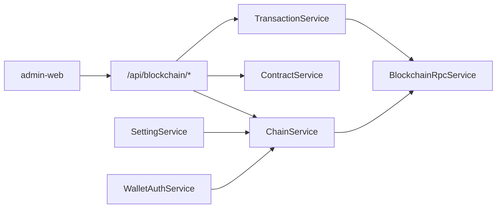

# 区块链系统（链基础运营）方案

> 管理端 EVM 链/RPC/合约配置与链上交易监控。接口摘要见 [技术方案文档.md](./技术方案文档.md) §2.8。

## 1. 目标与边界

**目标**：在现有 Web3 钱包登录能力之上，提供可运营的链基础配置与交易状态跟踪。

**已确认**：

- 范围：链配置、合约登记、交易记录监控（管理端）
- 链类型：仅 EVM（viem）
- 数据源：`bc_chain` 替代静态 `evm-chains.ts`

**不做（本期）**：

- 私钥托管与链上代发
- 全量区块索引 / 事件订阅
- 会员 Web3 登录
- 非 EVM 链

## 2. 架构

## 3. 数据模型

| 表 | 说明 |
|----|------|
| `bc_chain` | 链 ID、RPC、浏览器、启用/钱包登录开关 |
| `bc_contract` | 合约地址登记、ABI、类型 |
| `bc_transaction` | 手工登记 txHash，RPC 轮询 receipt 更新状态 |

迁移脚本：

- `server/scripts/blockchain-chain.sql`
- `server/scripts/blockchain-contract.sql`
- `server/scripts/blockchain-transaction.sql`

## 4. API 清单

前缀 `/api/blockchain`，鉴权：后台 JWT + RBAC。

### 4.1 链管理 `chain:*`

| 方法 | 路径 | 说明 |
|------|------|------|
| GET | `/chains` | 分页列表（RPC 脱敏） |
| GET | `/chains/enabled` | 启用链（Public） |
| GET | `/chains/:id` | 详情（完整 RPC） |
| POST | `/chains` | 创建 |
| PUT | `/chains/:id` | 更新 |
| DELETE | `/chains/:id` | 软删 |
| POST | `/chains/:id/health` | RPC 探活 |

### 4.2 合约管理 `contract:*`

标准 CRUD：`/contracts`

### 4.3 交易记录 `tx:*`

| 方法 | 路径 | 说明 |
|------|------|------|
| GET | `/transactions` | 分页筛选 |
| POST | `/transactions` | 手工登记 txHash |
| POST | `/transactions/:id/sync` | 立即同步 |
| GET | `/transactions/export` | CSV 导出 |

后台每 30s 自动同步 `pending` 交易（最多 20 条/次）。

## 5. 与 Web3 登录衔接

- `GET /api/settings/chains` 改读 `bc_chain`（`login_enabled=1`）
- `walletChainId` 保存时校验链已启用且允许钱包登录（`CHAIN_LOGIN_DISABLED`）
- 禁用/删除当前钱包登录链时返回 `CHAIN_LOGIN_IN_USE`

## 6. 管理端页面

| 路由 | 菜单 | 权限 |
|------|------|------|
| `/blockchain/chain` | 区块链 → 链管理 | `chain:list` |
| `/blockchain/contract` | 区块链 → 合约管理 | `contract:list` |
| `/blockchain/transaction` | 区块链 → 交易记录 | `tx:list` |

## 7. 验收标准

- [x] 链 CRUD + RPC 探活
- [x] 系统设置/登录链下拉来自数据库
- [x] 合约登记与地址校验
- [x] 交易登记、同步、导出
- [x] Dashboard 启用链数 / 待确认交易数
- [x] `npm run build` 通过

## 8. 后续（P2）

- 合约事件订阅
- RPC 密钥环境变量引用
- 会员 Web3 / 链上业务对接
