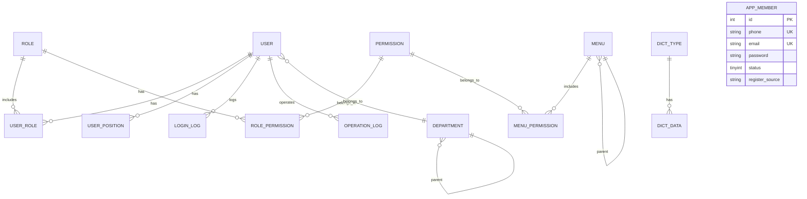
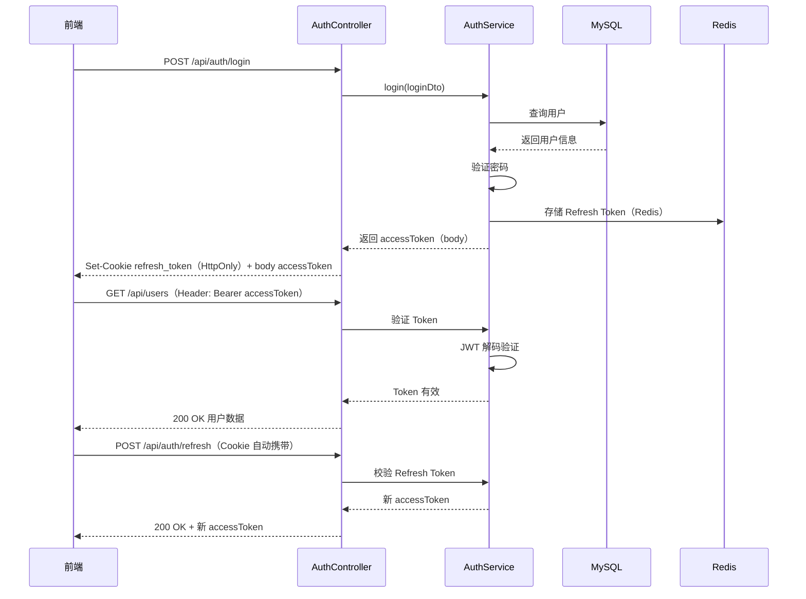
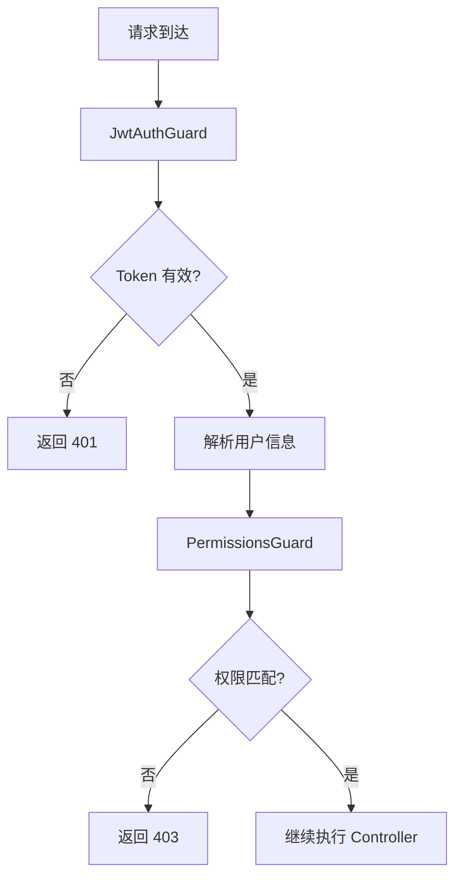
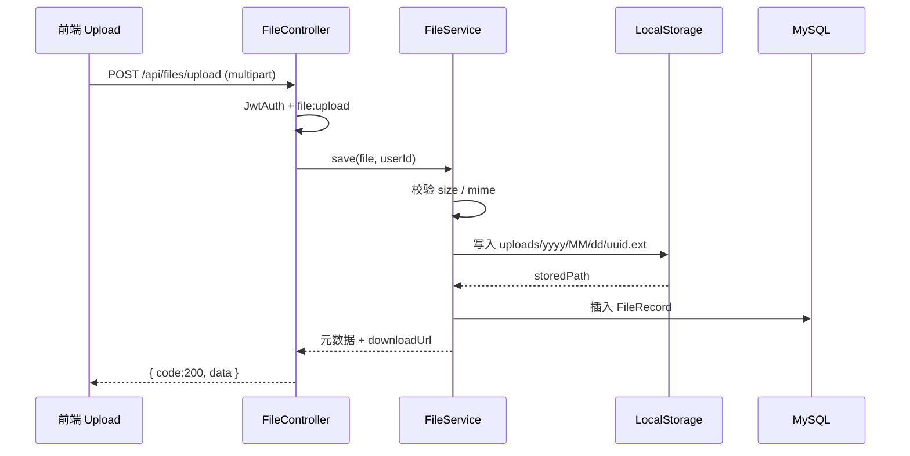
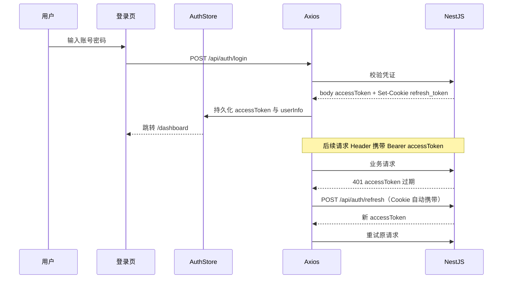

# NestJS 基础管理系统 - 技术方案文档

## 1. 项目概述

本文档为基于 **NestJS 后端 + React 管理后台** 的基础管理系统提供完整的功能分析与任务排期规划。后端负责 API 与数据层，前端负责后台管理界面（登录、菜单、CRUD、运维看板等）。

### 1.1 项目目标

构建一个功能完整、架构清晰、易于扩展的企业级基础管理系统，涵盖：

- **后端**：用户管理、认证授权、业务管理、文件管理、系统运维（API 层）
- **前端**：配套后台管理界面，与后端 RBAC、菜单、接口一一对应

### 1.2 技术栈

| 分类 | 技术 | 版本 | 选型理由 |
|------|------|------|----------|
| 框架 | NestJS | 10.x | 企业级 Node.js 框架，内置 DI、模块化、CLI 工具 |
| 语言 | TypeScript | 5.x | 类型安全，利于大型项目维护 |
| ORM | TypeORM | 0.3.x | NestJS 官方推荐，支持多种数据库 |
| 数据库 | MySQL | 8.x | 成熟稳定，社区活跃，适合中小型管理系统 |
| 缓存 | Redis | 7.x | 会话管理、Token 存储、热点数据缓存 |
| 认证 | @nestjs/jwt + passport-jwt | ^10 / ^4 | JWT 签发与 Passport 策略 |
| API 文档 | Swagger | 7.x | 自动生成接口文档，便于前后端协作 |
| 参数校验 | Class-Validator | 0.14.x | 声明式校验，与 NestJS 深度集成 |

日常编码约束、命名规范与质量门禁详见 [前后端开发规范](./前后端开发规范.md)。

### 1.3 前端技术栈（管理后台）

| 分类 | 技术 | 版本 | 选型理由 |
|------|------|------|----------|
| 框架 | React | 18.x | 生态成熟，组件化开发效率高 |
| 构建工具 | Vite | 5.x | 冷启动快，HMR 体验好 |
| UI 组件库 | Ant Design | 5.x | 企业级后台组件齐全（Table、Form、Tree） |
| 路由 | React Router | 6.x | 声明式路由，支持嵌套布局 |
| 状态管理 | Zustand | 4.x | 轻量，适合 Token、用户信息、全局配置 |
| HTTP 客户端 | Axios | 1.x | 拦截器便于统一处理 Token 与错误 |
| 语言 | TypeScript | 5.x | 与后端类型定义可共享约定 |

### 1.4 实施前置决策（已确定）

以下决策为全栈实现的唯一标准，前后端文档与代码须保持一致：

| 决策项 | 选定方案 | 说明 |
|--------|----------|------|
| 仓库布局 | Monorepo | `server/` + `admin-web/` 同仓 |
| Access Token | 前端 `sessionStorage` | 请求头 `Authorization: Bearer` 携带 |
| Refresh Token | 后端 `HttpOnly` Cookie | 登录/刷新时 `Set-Cookie`；前端不读写、不存 Store |
| 菜单路由 | 后端驱动 | 登录后 `GET /api/menus/tree` 生成侧边栏与动态路由 |
| API JSON 字段 | camelCase | 数据库列 snake_case，对外 JSON 统一 camelCase |
| 富文本编辑器 | wangEditor 5 | 通知公告等富文本场景 |

Refresh 接口 `POST /api/auth/refresh` 依赖 Cookie 自动携带，无需前端传 `refresh_token` 请求体。

---

## 2. 功能模块清单

### 2.1 核心框架层（Core）

| 子模块 | 功能描述 | 优先级 |
|--------|----------|--------|
| 统一响应封装 | 统一成功/失败响应格式，支持分页响应 | P0 |
| 全局异常过滤器 | 捕获并格式化所有异常，区分业务异常和系统异常 | P0 |
| 请求拦截器 | 请求日志记录、耗时统计 | P0 |
| 响应拦截器 | 统一数据包装、敏感字段脱敏 | P0 |
| 参数校验 | 使用 Class-Validator 进行 DTO 校验 | P0 |

### 2.2 认证授权层（Auth）

| 子模块 | 功能描述 | 优先级 |
|--------|----------|--------|
| 用户管理 | 用户增删改查、密码重置、状态管理 | P1 |
| 登录认证 | JWT Token 生成/验证、刷新机制；Web3 钱包签名登录见 [Web3钱包登录方案.md](./Web3钱包登录方案.md) | P1 |
| 角色管理 | 角色增删改查、角色分配 | P1 |
| 权限管理 | 权限点管理、权限分配 | P1 |
| 菜单管理 | 菜单树维护、菜单权限关联 | P1 |
| RBAC 守卫 | 基于角色的访问控制 | P1 |

### 2.3 业务管理层（Business）

| 子模块 | 功能描述 | 优先级 |
|--------|----------|--------|
| 部门管理 | 部门树结构、部门用户关联 | P2 |
| 岗位管理 | 岗位增删改查、用户岗位关联 | P2 |
| 字典管理 | 字典类型、字典数据维护 | P2 |
| 系统公告 | 公告发布、投递范围、个人消息收件箱（仅后台用户） | P2 |

### 2.4 系统运维层（Ops）

| 子模块 | 功能描述 | 优先级 |
|--------|----------|--------|
| 操作日志 | 记录所有 CRUD 操作，支持查询和导出 | P3 |
| 登录日志 | 记录登录成功/失败记录，含 `loginType`（password/wallet/both） | P3 |
| 防护日志 | 记录认证/钱包安全事件（验签失败、地址不匹配等），支持查询和导出 | P3 |
| 在线用户 | 当前在线用户列表、强制下线 | P3 |
| 系统监控 | 服务器状态、进程信息、数据库连接数 | P3 |

### 2.5 文件管理层（File）

| 子模块 | 功能描述 | 优先级 |
|--------|----------|--------|
| 文件上传 | 单文件/多文件上传，类型与大小校验，本地存储（可扩展 OSS） | P4 |
| 文件元数据 | 记录原始文件名、存储路径、MIME、大小、上传人 | P4 |
| 文件列表 | 分页查询、按文件名/类型/上传人/时间筛选 | P4 |
| 文件下载 | 鉴权下载，支持 `Content-Disposition` 附件名 | P4 |
| 文件删除 | 软删除元数据，可选同步删除磁盘文件 | P4 |
| 通用上传组件 | 前端可复用 `Upload` 封装，供公告/头像等场景调用 | P4 |

**存储策略（P4 默认）：**

- 开发环境：磁盘目录 `server/uploads/`（不入库 Git，`.gitignore` 忽略）
- 访问方式：`GET /api/files/:id/download` 经后端鉴权输出流（不直接暴露静态目录）
- 扩展预留：`storage.driver` 配置项（`local` / `oss`），便于后续切换对象存储

### 2.6 后台管理界面（Admin UI）

与 §2.1–§2.5 后端模块一一对应的前端页面规划：

| 模块 | 页面 | 核心功能 | 优先级 | 对应后端 |
|------|------|----------|--------|----------|
| 登录 | `/login` | 账号密码登录、记住我、跳转首页 | P0 | §7.1 认证接口 |
| 布局 | `/`（Layout） | 侧边栏菜单、顶栏、面包屑、用户下拉 | P0 | §7.5 菜单树 |
| 工作台 | `/dashboard` | 统计卡片、快捷入口 | P1 | 聚合接口（可选） |
| 系统用户 | `/system/user` | 用户列表、新增/编辑弹窗、重置密码、状态切换 | P1 | §7.2 用户接口 |
| 角色管理 | `/system/role` | 角色 CRUD、分配权限（树形勾选） | P1 | §7.3 角色接口 |
| 权限管理 | `/system/permission` | 权限点 CRUD | P1 | §7.4 权限接口 |
| 菜单管理 | `/system/menu` | 菜单树维护、图标与路由配置 | P1 | §7.5 菜单接口 |
| 部门管理 | `/org/department` | 部门树 + 右侧列表/表单 | P2 | §7.6 部门接口 |
| 岗位管理 | `/org/position` | 岗位 CRUD | P2 | §7.10 岗位接口 |
| 字典管理 | `/system/dict` | 字典类型 Tab + 字典数据子表 | P2 | §7.7 字典接口 |
| 系统公告 | `/system/notice` | 公告列表、富文本编辑、发布状态 | P2 | §7.11 通知接口 |
| 操作日志 | `/monitor/operation-log` | 分页查询、筛选、导出 | P3 | §7.8 日志接口 |
| 登录日志 | `/monitor/login-log` | 分页查询、筛选、导出 | P3 | §7.8 日志接口 |
| 防护日志 | `/monitor/protection-log` | 认证/钱包安全事件查询、导出 | P3 | §7.8 日志接口 |
| 在线用户 | `/monitor/online` | 在线列表、强制下线 | P3 | §7.9 监控接口 |
| 系统监控 | `/monitor/system` | CPU/内存/运行时长等状态展示 | P3 | §7.9 监控接口 |
| 文件管理 | `/system/file` | 上传、列表、预览/下载、删除 | P4 | §7.13 文件接口 |
| 个人中心 | `/profile` | 修改资料、修改密码 | P2 | 用户接口（顶栏下拉，非侧栏菜单） |
| C 端用户 | `/member/list` | 会员列表、CRUD、重置密码、启用/禁用 | P0 | §7.2.1 C 端用户管理 |

**前端通用能力（横切）：**

- 路由守卫：未登录跳转 `/login`，无权限显示 403 页
- 动态菜单：登录后根据 `/api/menus/tree` 生成侧边栏
- 按钮级权限：根据权限码控制「新增」「删除」等操作按钮显隐
- 统一请求封装：Axios 拦截器附加 `Authorization`，401 自动刷新 Token 或登出
- 统一表格模式：Ant Design `Table` + `Form` + `Modal` 完成 CRUD
- 文件上传：`Upload` + `multipart/form-data`，进度条与失败重试；大文件受后端大小限制

### 2.7 C 端用户管理（Member）

> **完整需求与实现说明**见 [C端用户管理方案.md](./C端用户管理方案.md)。

| 子模块 | 功能描述 | 优先级 |
|--------|----------|--------|
| C 端用户实体 | 独立表 `app_member`，与 `sys_user` 无关联 | P0 |
| 管理端 CRUD | `/api/members`，RBAC `member:*`，admin-web「用户管理 → 会员用户」 | P0 |
| C 端认证 API | `/api/app/auth/*` 注册/登录/刷新/登出/资料 | P0 |
| JWT 双轨隔离 | 后台 `type: admin`，C 端 `type: member`；独立 Refresh Cookie | P0 |

### 2.8 区块链系统（链基础运营）

> **完整需求与实现说明**见 [区块链系统方案.md](./区块链系统方案.md)。

| 子模块 | 功能描述 | 优先级 |
|--------|----------|--------|
| 链配置 | `bc_chain` 多 RPC、探活、钱包登录链开关 | P0 |
| 合约登记 | `bc_contract` 地址/ABI/类型管理 | P1 |
| 交易监控 | `bc_transaction` 手工登记 + RPC 同步 | P1 |
| 设置衔接 | `GET /api/settings/chains` 读 DB | P0 |

---

## 3. 项目结构

Monorepo 根目录布局见 [前后端开发规范 §1](./前后端开发规范.md#1-仓库结构)。

### 3.1 后端项目结构（server/）

```
server/src/
├── common/                    # 公共模块
│   ├── filters/               # 异常过滤器
│   │   └── http-exception.filter.ts
│   ├── interceptors/          # 拦截器
│   │   ├── response.interceptor.ts
│   │   └── logging.interceptor.ts
│   ├── guards/                # 守卫
│   │   └── permissions.guard.ts
│   ├── decorators/            # 自定义装饰器
│   │   ├── public.decorator.ts
│   │   └── require-permissions.decorator.ts
│   ├── utils/                 # 工具函数
│   │   ├── crypto.ts
│   │   └── pagination.ts
│   └── exceptions/            # 自定义异常
│       └── business.exception.ts
├── modules/                   # 业务域聚合（按功能域划分，便于扩展）
│   ├── base/                  # 基础管理系统（认证、用户、组织、运维等）
│   │   ├── base.module.ts     # 聚合模块，AppModule 仅 import 此模块
│   │   ├── auth/              # 认证模块
│   │   │   ├── auth.controller.ts
│   │   │   ├── auth.service.ts
│   │   │   ├── auth.module.ts
│   │   │   ├── dto/
│   │   │   │   ├── login.dto.ts
│   │   │   │   └── refresh-token.dto.ts
│   │   │   └── strategies/
│   │   │       └── jwt.strategy.ts
│   │   ├── user/              # 用户模块
│   │   │   ├── user.controller.ts
│   │   │   ├── user.service.ts
│   │   │   ├── user.module.ts
│   │   │   ├── dto/
│   │   │   └── entities/
│   │   │       └── user.entity.ts
│   │   ├── role/              # 角色模块
│   │   │   ├── role.controller.ts
│   │   │   ├── role.service.ts
│   │   │   ├── role.module.ts
│   │   │   ├── dto/
│   │   │   └── entities/
│   │   │       └── role.entity.ts
│   │   ├── permission/        # 权限模块
│   │   │   ├── permission.controller.ts
│   │   │   ├── permission.service.ts
│   │   │   ├── permission.module.ts
│   │   │   ├── dto/
│   │   │   └── entities/
│   │   │       └── permission.entity.ts
│   │   ├── menu/              # 菜单模块
│   │   │   ├── menu.controller.ts
│   │   │   ├── menu.service.ts
│   │   │   ├── menu.module.ts
│   │   │   ├── dto/
│   │   │   └── entities/
│   │   │       └── menu.entity.ts
│   │   ├── department/        # 部门模块
│   │   │   ├── department.controller.ts
│   │   │   ├── department.service.ts
│   │   │   ├── department.module.ts
│   │   │   ├── dto/
│   │   │   └── entities/
│   │   │       └── department.entity.ts
│   │   ├── position/          # 岗位模块
│   │   │   ├── position.controller.ts
│   │   │   ├── position.service.ts
│   │   │   ├── position.module.ts
│   │   │   ├── dto/
│   │   │   └── entities/
│   │   │       └── position.entity.ts
│   │   ├── dict/              # 字典模块
│   │   │   ├── dict.controller.ts
│   │   │   ├── dict.service.ts
│   │   │   ├── dict.module.ts
│   │   │   ├── dto/
│   │   │   └── entities/
│   │   │       ├── dict-type.entity.ts
│   │   │       └── dict-data.entity.ts
│   │   ├── notice/            # 通知公告（内容管理 + 发布投递）
│   │   │   ├── notice.controller.ts
│   │   │   ├── notice.service.ts
│   │   │   ├── notice-publish.service.ts
│   │   │   ├── notice.module.ts
│   │   │   ├── dto/
│   │   │   └── entities/
│   │   │       └── notice.entity.ts
│   │   ├── message/           # 个人消息（后台用户收件箱）
│   │   │   ├── message.controller.ts
│   │   │   ├── message.service.ts
│   │   │   ├── message.module.ts
│   │   │   ├── dto/
│   │   │   └── entities/
│   │   │       └── user-message.entity.ts
│   │   ├── log/               # 日志模块
│   │   │   ├── log.controller.ts
│   │   │   ├── log.service.ts
│   │   │   ├── log.module.ts
│   │   │   ├── dto/
│   │   │   └── entities/
│   │   │       ├── operation-log.entity.ts
│   │   │       └── login-log.entity.ts
│   │   └── monitor/           # 监控模块
│   │       ├── monitor.controller.ts
│   │       ├── monitor.service.ts
│   │       └── monitor.module.ts
│   │   └── file/              # 文件管理模块（P4）
│   │       ├── file.controller.ts
│   │       ├── file.service.ts
│   │       ├── file.module.ts
│   │       ├── storage/       # 存储驱动（local / 可扩展 oss）
│   │       │   ├── storage.interface.ts
│   │       │   └── local.storage.ts
│   │       ├── dto/
│   │       │   └── query-file.dto.ts
│   │       └── entities/
│   │           └── file.entity.ts
│   └── member/                  # C 端用户域（与 base 平级）
│       ├── member.module.ts
│       ├── member.service.ts
│       ├── entities/member.entity.ts
│       ├── dto/
│       ├── admin/member-admin.controller.ts   # /api/members
│       └── app/
│           ├── member-auth.controller.ts        # /api/app/auth
│           ├── member-auth.service.ts
│           ├── strategies/member-jwt.strategy.ts
│           └── guards/member-jwt.guard.ts
│   └── {feature}/               # 未来功能域（如 crm、workflow），结构同 base/
│       ├── {feature}.module.ts
│       └── ...
├── config/                    # 配置文件
│   ├── configuration.ts
│   └── typeorm.config.ts
├── entities/                  # 数据库实体基类
│   └── base.entity.ts
└── main.ts                    # 入口文件
```

以上路径均位于 `server/src/` 下。

**模块域划分说明：**

- `modules/base/`：当前基础管理系统全部子模块（§2.1–§2.4），由 `BaseModule` 统一聚合注册
- `modules/{feature}/`：后续新增业务域（如 CRM、工作流），与 `base` 平级，各自提供 `{Feature}Module`，`AppModule` 按需 import
- API 路由前缀不变（仍为 `/api/users` 等），域目录仅影响代码组织，不影响对外接口

```typescript
// app.module.ts
@Module({
  imports: [BaseModule, MemberModule, /* CrmModule, WorkflowModule ... */],
})
export class AppModule {}
```

### 3.2 前端项目结构（admin-web）

建议与后端 **同仓 Monorepo** 或 **独立仓库** `admin-web/`，目录如下：

```
admin-web/
├── public/
├── src/
│   ├── api/                   # 按模块封装的 API 请求
│   │   ├── auth.ts
│   │   ├── user.ts
│   │   ├── file.ts            # P4 文件上传/列表/下载
│   │   └── ...
│   ├── components/            # 通用组件
│   │   ├── PageTable/         # 列表页模板
│   │   ├── AuthButton/        # 权限按钮
│   │   ├── FileUpload/        # P4 通用上传组件
│   │   └── IconPicker/
│   ├── layouts/
│   │   └── BasicLayout.tsx    # 侧边栏 + 顶栏布局
│   ├── pages/
│   │   ├── login/
│   │   ├── dashboard/
│   │   ├── system/            # 用户、角色、权限、菜单、字典、公告、文件
│   │   ├── member/            # C 端用户列表
│   │   ├── org/               # 部门、岗位
│   │   └── monitor/           # 日志、在线用户、系统监控
│   ├── router/
│   │   ├── index.tsx
│   │   ├── routes.tsx         # 静态路由
│   │   └── guard.tsx          # 登录与权限守卫
│   ├── stores/
│   │   ├── useAuthStore.ts    # Token、用户信息
│   │   └── useMenuStore.ts    # 动态菜单
│   ├── utils/
│   │   ├── request.ts         # Axios 实例与拦截器
│   │   └── permission.ts      # 权限判断工具
│   ├── App.tsx
│   └── main.tsx
├── .env.development           # VITE_API_BASE_URL=http://localhost:3000/api
├── index.html
├── package.json
├── tsconfig.json
└── vite.config.ts
```

---

## 4. 任务排期表

### 4.1 P0：基础脚手架搭建（第 1-2 天）

| 序号 | 任务 | 预估工时 | 关键交付物 | 依赖 |
|------|------|----------|------------|------|
| 1 | 项目初始化 | 2h | 在 `server/` 下 `nest new` 创建后端结构 | - |
| 2 | 依赖安装 | 1h | TypeORM、MySQL、Redis、JWT、Swagger 等 | 1 |
| 3 | 数据库配置 | 2h | `typeorm.config.ts`、实体基类、连接池配置 | 2 |
| 4 | 统一响应封装 | 2h | `ResponseInterceptor`、分页响应类 | 1 |
| 5 | 全局异常过滤器 | 2h | `HttpExceptionFilter`、自定义业务异常 | 1 |
| 6 | 请求日志拦截器 | 1h | 记录请求路径、参数、耗时 | 1 |
| 7 | 参数校验配置 | 1h | `ValidationPipe` 全局注册 | 2 |
| 8 | Docker 配置 | 1h | `docker-compose.yml`（MySQL + Redis） | - |

**阶段目标**：完成项目骨架搭建，建立统一的开发规范和基础中间件。

---

### 4.2 P1：认证授权体系（第 3-5 天）

| 序号 | 任务 | 预估工时 | 关键交付物 | 依赖 |
|------|------|----------|------------|------|
| 9 | 用户实体与 DTO | 2h | `User` 实体、创建/更新/查询 DTO | P0 |
| 10 | 用户 CRUD 接口 | 3h | `UserController` + `UserService` | 9 |
| 11 | JWT 认证模块 | 3h | `AuthModule`、登录/刷新/登出接口 | P0 |
| 12 | 密码加密 | 1h | bcrypt 加密、密码验证 | 10 |
| 13 | 角色实体与接口 | 2h | `Role` 实体、CRUD 接口 | P0 |
| 14 | 权限实体与接口 | 2h | `Permission` 实体、CRUD 接口 | P0 |
| 15 | 菜单实体与接口 | 3h | `Menu` 实体（树结构）、CRUD 接口 | P0 |
| 16 | RBAC 守卫实现 | 3h | `PermissionsGuard`、权限校验逻辑 | 13, 14, 15 |
| 17 | 菜单权限关联 | 2h | 菜单与权限的多对多关系 | 14, 15 |

**阶段目标**：完成用户管理、认证授权和 RBAC 权限系统的完整实现。

---

### 4.3 P2：业务管理模块（第 6-8 天）

| 序号 | 任务 | 预估工时 | 关键交付物 | 依赖 |
|------|------|----------|------------|------|
| 18 | 部门管理 | 3h | `Department` 实体（树结构）、CRUD 接口 | P0 |
| 19 | 岗位管理 | 2h | `Position` 实体、CRUD 接口 | P0 |
| 20 | 字典管理 | 3h | `DictType` + `DictData` 实体、CRUD 接口 | P0 |
| 21 | 通知公告 | 2h | `Notice` 实体、发布/列表/详情接口 | P0 |
| 22 | 用户-部门关联 | 1h | 用户与部门的外键关联 | 9, 18 |
| 23 | 用户-岗位关联 | 1h | 用户与岗位的多对多关联 | 9, 19 |

**阶段目标**：完成部门、岗位、字典、通知等业务模块的实现。

---

### 4.4 P3：系统运维模块（第 9-11 天）

| 序号 | 任务 | 预估工时 | 关键交付物 | 依赖 |
|------|------|----------|------------|------|
| 24 | 操作日志 | 3h | `OperationLog` 实体、自动记录中间件 | P0 |
| 25 | 登录日志 | 2h | `LoginLog` 实体、登录时记录 | 11 |
| 26 | 在线用户 | 3h | Redis 存储在线状态、强制下线接口 | P0, 11 |
| 27 | 系统监控 | 2h | 服务器状态、数据库连接、进程信息 | P0 |
| 28 | 接口导出功能 | 2h | 日志数据导出 Excel | 24, 25 |
| 29 | API 文档完善 | 1h | Swagger 注解补充 | 全部 |
| 30 | 单元测试 | 3h | 核心模块测试用例 | 全部 |

**阶段目标**：完成日志审计、在线用户、系统监控等运维模块的实现。

---

### 4.5 P4：文件管理与上传（第 12-13 天）

| 序号 | 任务 | 预估工时 | 关键交付物 | 依赖 |
|------|------|----------|------------|------|
| 31 | 文件实体与配置 | 1h | `FileRecord` 实体、`upload.*` 配置项 | P0 |
| 32 | 本地存储驱动 | 2h | `LocalStorageService`、目录按日期分片 `uploads/yyyy/MM/dd/` | 31 |
| 33 | 上传接口 | 3h | `POST /api/files/upload`（`FileInterceptor`）、类型/大小校验 | 32, P1 |
| 34 | 文件列表与详情 | 2h | 分页查询、筛选、元数据返回 | 31 |
| 35 | 下载与删除 | 2h | `GET .../download`、`DELETE /api/files/:id` | 32, 34 |
| 36 | RBAC 与种子 | 1h | 权限码 `file:*`、菜单「文件管理」 | P1 |
| 37 | 单元/接口测试 | 2h | 上传、越权下载、非法类型用例 | 33–35 |

**阶段目标**：完成文件上传、列表、下载、删除闭环；存储层接口化便于后续接 OSS。

**配置项（`server/.env`）：**

```bash
# 文件上传
UPLOAD_DEST=uploads
UPLOAD_MAX_SIZE=10485760          # 单文件最大 10MB（字节）
UPLOAD_ALLOWED_MIME=image/jpeg,image/png,image/gif,application/pdf,application/vnd.openxmlformats-officedocument.wordprocessingml.document,application/vnd.openxmlformats-officedocument.spreadsheetml.sheet
```

**权限码：**

| 权限码 | 说明 |
|--------|------|
| `file:list` | 查看文件列表与详情 |
| `file:upload` | 上传文件 |
| `file:download` | 下载/预览文件 |
| `file:delete` | 删除文件记录 |

---

### 4.6 F0：前端脚手架（第 1-2 天，与后端 P0 并行）

| 序号 | 任务 | 预估工时 | 关键交付物 | 依赖 |
|------|------|----------|------------|------|
| F1 | 项目初始化 | 1h | `npm create vite@latest admin-web -- --template react-ts` | - |
| F2 | 依赖安装 | 1h | antd、react-router、axios、zustand | F1 |
| F3 | 目录与别名配置 | 1h | `@/` 路径别名、`vite.config.ts` | F1 |
| F4 | Axios 封装 | 2h | 请求/响应拦截器、Token 注入、错误提示 | F2 |
| F5 | 路由与布局骨架 | 2h | `BasicLayout`、404/403 页、路由占位 | F2 |
| F6 | 登录页 | 2h | 登录表单、调用 `/api/auth/login`、跳转 | 后端 P0 |

**阶段目标**：可运行的前端工程，完成登录与主布局骨架。

---

### 4.7 F1：认证与系统管理页（第 3-5 天，与后端 P1 并行）

| 序号 | 任务 | 预估工时 | 关键交付物 | 依赖 |
|------|------|----------|------------|------|
| F7 | 动态菜单 | 3h | 根据菜单树渲染侧边栏、面包屑 | 后端 P1 菜单接口 |
| F8 | 路由守卫 | 2h | 未登录重定向、Token 过期处理 | F4, F7 |
| F9 | 系统用户页 | 4h | 表格、搜索、新增/编辑弹窗、重置密码 | 后端 P1 用户接口 |
| F10 | 角色管理页 | 3h | 角色 CRUD、分配权限树 | 后端 P1 角色接口 |
| F11 | 权限管理页 | 2h | 权限点 CRUD | 后端 P1 权限接口 |
| F12 | 菜单管理页 | 3h | 菜单树表格、图标与路由配置 | 后端 P1 菜单接口 |
| F13 | 权限按钮组件 | 2h | `AuthButton` 按权限码显隐 | F8 |

**阶段目标**：系统管理核心页面可用，菜单与 RBAC 与后端联调通过。

---

### 4.8 F2：业务管理页（第 6-8 天，与后端 P2 并行）

| 序号 | 任务 | 预估工时 | 关键交付物 | 依赖 |
|------|------|----------|------------|------|
| F14 | 部门管理页 | 3h | 左树右表、部门 CRUD | 后端 P2 |
| F15 | 岗位管理页 | 2h | 岗位 CRUD | 后端 P2 |
| F16 | 字典管理页 | 3h | 类型 Tab + 字典数据子表 | 后端 P2 |
| F17 | 通知公告页 | 3h | 列表 + 富文本编辑（如 wangEditor） | 后端 P2 |
| F18 | 个人中心 | 2h | 修改资料、修改密码 | 后端 P1 |

**阶段目标**：组织架构与业务配置类页面完成。

---

### 4.9 F3：运维监控页（第 9-11 天，与后端 P3 并行）

| 序号 | 任务 | 预估工时 | 关键交付物 | 依赖 |
|------|------|----------|------------|------|
| F19 | 操作日志页 | 3h | 筛选、分页、导出 | 后端 P3 |
| F20 | 登录日志页 | 2h | 筛选、分页、导出 | 后端 P3 |
| F21 | 在线用户页 | 2h | 列表、强制下线 | 后端 P3 |
| F22 | 系统监控页 | 2h | 状态卡片、定时刷新 | 后端 P3 |
| F23 | 工作台 Dashboard | 2h | 统计卡片、快捷入口 | 可选聚合接口 |
| F24 | 构建与部署配置 | 2h | `npm run build`、Nginx 静态托管配置 | F0 |

**阶段目标**：运维类页面完成，前端可独立构建部署。

---

### 4.10 F4：文件管理页（第 12-13 天，与后端 P4 并行）

| 序号 | 任务 | 预估工时 | 关键交付物 | 依赖 |
|------|------|----------|------------|------|
| F25 | 文件 API 封装 | 1h | `api/file.ts`：upload、list、download、delete | 后端 P4 |
| F26 | 通用上传组件 | 2h | `components/FileUpload`：拖拽/点击、进度、鉴权 | F25 |
| F27 | 文件管理页 | 3h | `/system/file` 列表、筛选、上传弹窗、预览/下载 | F25, F26 |
| F28 | 图片预览 | 1h | 图片类型 `Image` 预览，其他类型触发下载 | F27 |
| F29 | 路由与菜单联调 | 1h | 注册路由、侧栏「系统管理 → 文件管理」 | F27 |

**阶段目标**：文件管理页可用；`FileUpload` 组件可在公告等模块复用。

**页面交互要点：**

- 列表：文件名、类型、大小（格式化）、上传人、上传时间、操作（下载/删除）
- 上传：`Modal` + `Upload.Dragger`，支持多选；超出大小/类型时展示后端 `message`
- 下载：带 Token 的 `blob` 下载或 `window.open`（经 Axios `responseType: 'blob'`）
- 删除：`Popconfirm` 二次确认，删除后刷新列表

---

## 5. 总览

### 5.1 后端排期

| 阶段 | 时间跨度 | 核心产出 | 工时合计 |
|------|----------|----------|----------|
| P0 | 2 天 | 项目骨架、基础中间件、数据库配置 | 11h |
| P1 | 3 天 | 用户管理、认证授权、RBAC 权限系统 | 20h |
| P2 | 3 天 | 部门、岗位、字典、通知等业务模块 | 12h |
| P3 | 3 天 | 日志审计、在线用户、系统监控 | 13h |
| P4 | 2 天 | 文件上传、文件管理、存储驱动 | 13h |
| **后端小计** | **13 天** | 完整 REST API | **69h** |

### 5.2 前端排期（管理后台）

| 阶段 | 时间跨度 | 核心产出 | 工时合计 |
|------|----------|----------|----------|
| F0 | 2 天 | Vite 脚手架、登录、布局、Axios 封装 | 9h |
| F1 | 3 天 | 动态菜单、用户/角色/权限/菜单管理页 | 19h |
| F2 | 3 天 | 部门、岗位、字典、公告、个人中心 | 13h |
| F3 | 3 天 | 日志、在线用户、监控、Dashboard、部署 | 13h |
| F4 | 2 天 | 文件管理页、通用上传组件 | 8h |
| **前端小计** | **13 天** | 完整管理后台界面 | **62h** |

### 5.3 全栈合计

| 维度 | 时间跨度 | 工时合计 |
|------|----------|----------|
| 后端 | 13 天 | 69h |
| 前端 | 13 天（可与后端并行） | 62h |
| **串行全栈** | **约 26 天** | **131h** |
| **双人并行（1 后端 + 1 前端）** | **约 13 天** | **131h** |

---

## 6. 数据库实体关系图



> C 端用户 `app_member` 与后台 `sys_user` 无关联，不参与 RBAC 关系图。

---

## 7. API 接口清单

### 7.1 认证接口

> **完整需求与实现说明**见 [Web3钱包登录方案.md](./Web3钱包登录方案.md)。

| 接口 | 方法 | 路径 | 描述 |
|------|------|------|------|
| 登录 | POST | /api/auth/login | 用户登录；`both` 模式返回 `loginTicket` |
| 钱包 nonce | GET | /api/auth/wallet/nonce | 获取签名消息（query: `chainId`, `address`, `loginTicket`） |
| 钱包登录 | POST | /api/auth/wallet/login | 仅 `wallet` 模式单因子登录 |
| 钱包完成 | POST | /api/auth/wallet/complete | `both` 模式第二步，验 ticket + 签名 |
| 刷新 Token | POST | /api/auth/refresh | 刷新 Token |
| 登出 | POST | /api/auth/logout | 用户登出 |

**登录方式**（`data/site.setting.json` → `loginMode`）：

| 模式 | 说明 |
|------|------|
| `password` | 仅账户密码（默认） |
| `wallet` | 仅钱包签名 |
| `both` | 先密码后钱包双重验证 |

**钱包链**：`walletChainId`（白名单 EVM 链，见 `GET /api/settings/chains`）

### 7.1.1 用户钱包绑定

| 接口 | 方法 | 路径 | 权限 | 描述 |
|------|------|------|------|------|
| 绑定钱包 | PUT | /api/users/:id/wallet | `user:bind-wallet` | 管理员绑定/换绑 |
| 解绑钱包 | DELETE | /api/users/:id/wallet | `user:bind-wallet` | 管理员解绑 |

迁移脚本：`server/scripts/web3-wallet.sql`

### 7.2 用户接口

| 接口 | 方法 | 路径 | 描述 |
|------|------|------|------|
| 用户列表 | GET | /api/users | 分页查询用户 |
| 用户详情 | GET | /api/users/:id | 查询单个用户 |
| 创建用户 | POST | /api/users | 创建新用户 |
| 更新用户 | PUT | /api/users/:id | 更新用户信息 |
| 删除用户 | DELETE | /api/users/:id | 删除用户 |
| 重置密码 | POST | /api/users/:id/reset-password | 重置用户密码 |
| 绑定钱包 | PUT | /api/users/:id/wallet | 绑定/换绑 EVM 地址 |
| 解绑钱包 | DELETE | /api/users/:id/wallet | 解绑钱包 |

### 7.2.1 C 端用户管理接口（后台 JWT + RBAC）

> 详见 [C端用户管理方案.md](./C端用户管理方案.md)。

| 接口 | 方法 | 路径 | 权限 | 描述 |
|------|------|------|------|------|
| 会员列表 | GET | /api/members | `member:list` | 分页；支持 `keyword` 模糊搜索 |
| 会员详情 | GET | /api/members/:id | `member:list` | 查询单个会员 |
| 创建会员 | POST | /api/members | `member:create` | 管理员创建（`registerSource=admin`） |
| 更新会员 | PUT | /api/members/:id | `member:update` | 更新昵称/头像/手机/邮箱/状态 |
| 删除会员 | DELETE | /api/members/:id | `member:delete` | 软删除 |
| 重置密码 | POST | /api/members/:id/reset-password | `member:reset-password` | 管理员重置密码 |

迁移脚本：`server/scripts/app-member.sql`

### 7.2.2 C 端认证接口（Member JWT / Public）

| 接口 | 方法 | 路径 | 鉴权 | 描述 |
|------|------|------|------|------|
| 注册 | POST | /api/app/auth/register | Public | 手机或邮箱 + 密码 |
| 登录 | POST | /api/app/auth/login | Public | 返回 accessToken，Set-Cookie `member_refresh_token` |
| 刷新 Token | POST | /api/app/auth/refresh | Cookie | 用 `member_refresh_token` 刷新 |
| 登出 | POST | /api/app/auth/logout | MemberJwt | 清除 Redis refresh + Cookie |
| 当前资料 | GET | /api/app/auth/me | MemberJwt | 当前会员信息 |
| 更新资料 | PUT | /api/app/auth/profile | MemberJwt | 改昵称/头像 |
| 修改密码 | PUT | /api/app/auth/password | MemberJwt | 验旧密码后修改 |

### 7.2.3 区块链接口（后台 JWT + RBAC）

> 详见 [区块链系统方案.md](./区块链系统方案.md)。

| 接口 | 方法 | 路径 | 权限 | 描述 |
|------|------|------|------|------|
| 链列表 | GET | /api/blockchain/chains | `chain:list` | 分页；列表 RPC 脱敏 |
| 启用链 | GET | /api/blockchain/chains/enabled | Public | 下拉用 |
| 链详情 | GET | /api/blockchain/chains/:id | `chain:list` | 含完整 RPC |
| 创建链 | POST | /api/blockchain/chains | `chain:create` | |
| 更新链 | PUT | /api/blockchain/chains/:id | `chain:update` | |
| 删除链 | DELETE | /api/blockchain/chains/:id | `chain:delete` | 软删 |
| RPC 探活 | POST | /api/blockchain/chains/:id/health | `chain:list` | `eth_blockNumber` |
| 合约 CRUD | GET/POST/PUT/DELETE | /api/blockchain/contracts | `contract:*` | 合约登记 |
| 交易列表 | GET | /api/blockchain/transactions | `tx:list` | 分页筛选 |
| 登记交易 | POST | /api/blockchain/transactions | `tx:create` | 手工登记 txHash |
| 同步交易 | POST | /api/blockchain/transactions/:id/sync | `tx:create` | RPC 拉 receipt |
| 导出交易 | GET | /api/blockchain/transactions/export | `tx:list` | CSV |

迁移脚本：`server/scripts/blockchain-*.sql`

### 7.3 角色接口

| 接口 | 方法 | 路径 | 描述 |
|------|------|------|------|
| 角色列表 | GET | /api/roles | 查询角色列表 |
| 角色详情 | GET | /api/roles/:id | 查询单个角色 |
| 创建角色 | POST | /api/roles | 创建新角色 |
| 更新角色 | PUT | /api/roles/:id | 更新角色信息 |
| 删除角色 | DELETE | /api/roles/:id | 删除角色 |
| 分配权限 | POST | /api/roles/:id/permissions | 为角色分配权限 |

### 7.4 权限接口

| 接口 | 方法 | 路径 | 描述 |
|------|------|------|------|
| 权限列表 | GET | /api/permissions | 查询权限列表 |
| 创建权限 | POST | /api/permissions | 创建新权限 |
| 更新权限 | PUT | /api/permissions/:id | 更新权限信息 |
| 删除权限 | DELETE | /api/permissions/:id | 删除权限 |

### 7.5 菜单接口

| 接口 | 方法 | 路径 | 描述 |
|------|------|------|------|
| 菜单树 | GET | /api/menus/tree | 获取菜单树结构 |
| 菜单列表 | GET | /api/menus | 查询菜单列表 |
| 创建菜单 | POST | /api/menus | 创建新菜单 |
| 更新菜单 | PUT | /api/menus/:id | 更新菜单信息 |
| 删除菜单 | DELETE | /api/menus/:id | 删除菜单 |

### 7.6 部门接口

| 接口 | 方法 | 路径 | 描述 |
|------|------|------|------|
| 部门树 | GET | /api/departments/tree | 获取部门树结构 |
| 部门列表 | GET | /api/departments | 查询部门列表 |
| 创建部门 | POST | /api/departments | 创建新部门 |
| 更新部门 | PUT | /api/departments/:id | 更新部门信息 |
| 删除部门 | DELETE | /api/departments/:id | 删除部门 |

### 7.7 字典接口

| 接口 | 方法 | 路径 | 描述 |
|------|------|------|------|
| 字典类型列表 | GET | /api/dict/types | 查询字典类型列表 |
| 创建字典类型 | POST | /api/dict/types | 创建字典类型 |
| 更新字典类型 | PUT | /api/dict/types/:id | 更新字典类型 |
| 删除字典类型 | DELETE | /api/dict/types/:id | 删除字典类型 |
| 字典数据列表 | GET | /api/dict/data | 查询字典数据列表 |
| 创建字典数据 | POST | /api/dict/data | 创建字典数据 |
| 更新字典数据 | PUT | /api/dict/data/:id | 更新字典数据 |
| 删除字典数据 | DELETE | /api/dict/data/:id | 删除字典数据 |

### 7.8 日志接口

| 接口 | 方法 | 路径 | 描述 |
|------|------|------|------|
| 操作日志列表 | GET | /api/logs/operation | 查询操作日志 |
| 登录日志列表 | GET | /api/logs/login | 查询登录日志 |
| 防护日志列表 | GET | /api/logs/protection | 查询防护日志 |
| 导出操作日志 | GET | /api/logs/operation/export | 导出操作日志 |
| 导出登录日志 | GET | /api/logs/login/export | 导出登录日志 |
| 导出防护日志 | GET | /api/logs/protection/export | 导出防护日志 |

### 7.9 监控接口

| 接口 | 方法 | 路径 | 描述 |
|------|------|------|------|
| 在线用户 | GET | /api/monitor/online-users | 获取在线用户列表 |
| 强制下线 | POST | /api/monitor/online-users/:id/kickout | 强制用户下线 |
| 系统状态 | GET | /api/monitor/system | 获取系统状态信息 |

### 7.10 岗位接口

| 接口 | 方法 | 路径 | 描述 |
|------|------|------|------|
| 岗位列表 | GET | /api/positions | 分页查询岗位 |
| 岗位详情 | GET | /api/positions/:id | 查询单个岗位 |
| 创建岗位 | POST | /api/positions | 创建岗位 |
| 更新岗位 | PUT | /api/positions/:id | 更新岗位 |
| 删除岗位 | DELETE | /api/positions/:id | 删除岗位 |

### 7.11 系统公告与个人消息

> **范围**：`modules/base/` 子功能，仅面向可登录 `admin-web` 的后台用户（`sys_user`），不对外部用户开放。

#### 7.11.1 数据模型

**`sys_notice`（公告内容）**

| 字段 | 类型 | 说明 |
|------|------|------|
| title | varchar(100) | 标题 |
| content | text | 正文（P2-3 升级为富文本） |
| status | tinyint | 0 草稿 / 1 已发布 / 2 已撤回 |
| noticeType | varchar(20) | `announcement` 公告 / `notification` 通知 |
| targetType | varchar(20) | `all` 全员 / `user` 指定用户 / `dept` 部门 / `role` 角色 |
| targetIds | json | 目标 ID 数组，配合 targetType |
| priority | varchar(20) | `normal` / `important`（重要消息弹窗） |
| publisherId | int | 发布人 userId |
| publishTime | datetime | 发布时间 |

**`sys_user_message`（个人收件箱，每人一条投递记录）**

| 字段 | 类型 | 说明 |
|------|------|------|
| userId | int | 接收人（后台用户） |
| noticeId | int | 关联公告，可空（预留系统消息） |
| title / content | — | 冗余快照 |
| messageType | varchar(20) | `notice` / `system` |
| isRead | tinyint | 0 未读 / 1 已读 |
| readAt | datetime | 阅读时间 |
| isPopup | tinyint | 是否弹窗提醒 |
| priority | varchar(20) | 消息优先级 |

在 `server/scripts/p2-1-notice-message.sql` 提供增量 DDL；开发环境重启后端（`synchronize: true`）亦可自动建表/加列。E2E 测试在 `create-e2e-app.ts` 中强制 `NODE_ENV=development` 以启用同步。


| 接口 | 方法 | 路径 | 权限码 | 描述 |
|------|------|------|--------|------|
| 公告列表 | GET | /api/notices | `notice:list` | 分页查询 |
| 公告详情 | GET | /api/notices/:id | `notice:list` | 详情 |
| 创建公告 | POST | /api/notices | `notice:create` | 创建草稿 |
| 更新公告 | PUT | /api/notices/:id | `notice:update` | 仅草稿可改 |
| 删除公告 | DELETE | /api/notices/:id | `notice:delete` | 软删除 |
| 发布公告 | PUT | /api/notices/:id/publish | `notice:update` | 解析投递范围并写入个人消息 |
| 撤回公告 | PUT | /api/notices/:id/revoke | `notice:update` | 标记公告已撤回 |

**发布公告请求体（可选覆盖投递范围）：**

```json
{
  "targetType": "all",
  "targetIds": []
}
```

**投递范围解析（目标均为 `status=1` 的后台用户）：**

| targetType | 解析规则 |
|------------|----------|
| all | 全部启用后台用户 |
| user | `targetIds` 指定用户 |
| dept | `departmentId` 匹配的用户 |
| role | 拥有指定角色的用户 |

#### 7.11.3 个人消息接口（登录即可，不需 `notice:list`）

| 接口 | 方法 | 路径 | 描述 |
|------|------|------|------|
| 未读数 | GET | /api/messages/unread-count | 当前用户未读消息数 |
| 我的消息 | GET | /api/messages/mine | 分页，`isRead` 可选筛选 |
| 消息详情 | GET | /api/messages/:id | 详情（自动标已读） |
| 标记已读 | PUT | /api/messages/:id/read | 单条已读 |
| 全部已读 | PUT | /api/messages/read-all | 批量已读 |

**我的消息列表响应：** 标准分页 `{ items, total, page, pageSize }`。

```json
{
  "id": 1,
  "noticeId": 10,
  "title": "系统维护通知",
  "content": "...",
  "messageType": "notice",
  "isRead": 0,
  "isPopup": 1,
  "priority": "important",
  "readAt": null,
  "createdAt": "2026-07-03T09:00:00.000Z"
}
```

### 7.12 健康检查

| 接口 | 方法 | 路径 | 描述 |
|------|------|------|------|
| 健康检查 | GET | /api/health | 服务存活与依赖连通性（`@Public()`） |

### 7.13 文件管理接口

| 接口 | 方法 | 路径 | 描述 | 权限码 |
|------|------|------|------|--------|
| 上传文件 | POST | /api/files/upload | `multipart/form-data`，字段名 `file`；支持多文件 | `file:upload` |
| 文件列表 | GET | /api/files | 分页查询，支持 `filename`、`mimeType`、`userId`、时间范围 | `file:list` |
| 文件详情 | GET | /api/files/:id | 查询单条元数据 | `file:list` |
| 下载文件 | GET | /api/files/:id/download | 流式输出，`Content-Disposition: attachment` | `file:download` |
| 删除文件 | DELETE | /api/files/:id | 软删除记录并删除磁盘文件 | `file:delete` |

**上传请求示例：**

```http
POST /api/files/upload HTTP/1.1
Authorization: Bearer <accessToken>
Content-Type: multipart/form-data; boundary=----...

------...
Content-Disposition: form-data; name="file"; filename="demo.png"
Content-Type: image/png

<binary>
------...--
```

**上传成功响应 `data` 示例：**

```json
{
  "id": 1,
  "originalName": "demo.png",
  "mimeType": "image/png",
  "size": 102400,
  "url": "/api/files/1/download",
  "createdAt": "2026-07-02T08:00:00.000Z"
}
```

**列表响应：** 标准分页 `{ items, total, page, pageSize }`，`items` 元素字段与详情一致。

**错误码：**

| errorCode | 说明 |
|-----------|------|
| `FILE_TOO_LARGE` | 超过 `UPLOAD_MAX_SIZE` |
| `FILE_TYPE_NOT_ALLOWED` | MIME 不在白名单 |
| `FILE_NOT_FOUND` | 文件不存在或已删除 |

---

## 8. 关键技术实现要点

### 8.1 JWT 认证流程



**JWT 双轨隔离（后台 vs C 端）：**

| 维度 | 后台 `sys_user` | C 端 `app_member` |
|------|-----------------|-------------------|
| Access Token payload | `{ sub, type: 'admin', permissions[] }` | `{ sub, type: 'member', account }` |
| Refresh Cookie | `refresh_token` | `member_refresh_token` |
| Strategy / Guard | `JwtStrategy` + 全局 `JwtAuthGuard` | `MemberJwtStrategy` + 路由级 `MemberJwtGuard` |
| 互斥 | `JwtStrategy` 拒绝 `type: member` | `MemberJwtStrategy` 仅接受 `type: member` |

旧版无 `type` 字段的后台 Token 视为 `admin`，保持兼容。

### 8.2 RBAC 权限校验



### 8.3 统一响应格式

```json
{
  "code": 200,
  "message": "success",
  "data": {
    "items": [],
    "total": 0,
    "page": 1,
    "pageSize": 10
  },
  "timestamp": 1699999999999
}
```

### 8.4 统一异常格式

```json
{
  "code": 400,
  "message": "参数错误",
  "errorCode": "VALIDATION_FAILED",
  "detail": "用户名不能为空",
  "timestamp": 1699999999999
}
```

HTTP 状态码与 body `code` 保持一致；业务子码使用 `errorCode`。

### 8.5 文件上传实现要点



**后端实现约定：**

1. 使用 `@nestjs/platform-express` 的 `FileInterceptor` / `FilesInterceptor`。
2. 磁盘文件名使用 UUID + 原扩展名，避免中文路径与重名覆盖。
3. `FileRecord` 实体字段建议：`originalName`、`storedName`、`storedPath`、`mimeType`、`size`、`uploadedBy`（userId）。
4. 下载接口读取磁盘流 pipe 到 `Response`，图片类型可设 `inline` 便于预览。
5. 删除时先 `softRemove` 实体，再 `fs.unlink`；磁盘不存在时记录日志但不阻断。
6. 操作日志拦截器会自动记录上传/删除（已有 P3 中间件）。

**前端实现约定：**

1. 上传请求使用独立 Axios 实例或 `request.post(url, formData, { headers: { 'Content-Type': 'multipart/form-data' } })`，不走 JSON 包装拦截器的特殊处理。
2. `FileUpload` 组件 props：`maxCount`、`accept`、`maxSize`、`onSuccess(fileMeta)`。
3. 文件管理页下载使用 `responseType: 'blob'`，根据 `mimeType` 决定预览或保存。

**数据库表（`sys_file`）草案：**

| 字段 | 类型 | 说明 |
|------|------|------|
| id | int PK | 主键 |
| original_name | varchar(255) | 原始文件名 |
| stored_name | varchar(100) | 存储文件名（UUID） |
| stored_path | varchar(500) | 相对路径 |
| mime_type | varchar(100) | MIME |
| size | bigint | 字节 |
| uploaded_by | int | 上传人 userId |
| created_at | datetime | 上传时间 |
| deleted_at | datetime | 软删除 |

---

## 9. 部署与运行

### 9.1 环境要求

- Node.js >= 20.0.0
- MySQL >= 8.0.0
- Redis >= 7.0.0

### 9.2 开发环境运行

```bash
# 安装依赖
cd server && npm install
cd ../admin-web && npm install

# 启动数据库（仓库根目录）
docker-compose up -d

# 启动后端
cd server && npm run start:dev

# 启动前端（另开终端）
cd admin-web && npm run dev
```

### 9.3 生产环境部署

```bash
# 构建项目
npm run build

# 启动生产服务器
npm run start:prod
```

---

## 10. 环境配置管理

### 10.1 .env 环境变量模板

```bash
# 服务器配置
PORT=3000
HOST=localhost

# 数据库配置
DB_HOST=localhost
DB_PORT=3306
DB_USERNAME=root
DB_PASSWORD=password
DB_DATABASE=sys_base

# Redis 配置
REDIS_HOST=localhost
REDIS_PORT=6379
REDIS_PASSWORD=
REDIS_DB=0

# JWT 配置
JWT_SECRET=your-secret-key-here-must-be-at-least-32-characters
JWT_ACCESS_TOKEN_EXPIRES_IN=15m
JWT_REFRESH_TOKEN_EXPIRES_IN=7d

# C 端会员 JWT（可选，默认 7d / 30d）
MEMBER_JWT_ACCESS_EXPIRES_IN=7d
MEMBER_JWT_REFRESH_EXPIRES_IN=30d

# 安全配置
BCRYPT_ROUNDS=10

# 日志配置
LOG_LEVEL=info
LOG_MAX_FILES=30

# 环境标识
NODE_ENV=development
```

### 10.2 ConfigModule 分环境配置

| 文件 | 用途 | 加载优先级 |
|------|------|------------|
| `.env` | 基础配置 | 默认加载 |
| `.env.development` | 开发环境配置 | `NODE_ENV=development` |
| `.env.staging` | 测试环境配置 | `NODE_ENV=staging` |
| `.env.production` | 生产环境配置 | `NODE_ENV=production` |

**配置加载逻辑**：
```typescript
// config/configuration.ts
import * as Joi from 'joi';

export default () => ({
  port: parseInt(process.env.PORT, 10) || 3000,
  database: {
    host: process.env.DB_HOST,
    port: parseInt(process.env.DB_PORT, 10) || 3306,
    username: process.env.DB_USERNAME,
    password: process.env.DB_PASSWORD,
    database: process.env.DB_DATABASE,
  },
  redis: {
    host: process.env.REDIS_HOST,
    port: parseInt(process.env.REDIS_PORT, 10) || 6379,
    password: process.env.REDIS_PASSWORD,
    db: parseInt(process.env.REDIS_DB, 10) || 0,
  },
  jwt: {
    secret: process.env.JWT_SECRET,
    accessTokenExpiresIn: process.env.JWT_ACCESS_TOKEN_EXPIRES_IN,
    refreshTokenExpiresIn: process.env.JWT_REFRESH_TOKEN_EXPIRES_IN,
  },
});

export const validationSchema = Joi.object({
  PORT: Joi.number().default(3000),
  DB_HOST: Joi.string().required(),
  DB_PORT: Joi.number().default(3306),
  DB_USERNAME: Joi.string().required(),
  DB_PASSWORD: Joi.string().required(),
  DB_DATABASE: Joi.string().required(),
  JWT_SECRET: Joi.string().min(32).required(),
});
```

---

## 11. 测试策略

### 11.1 测试分层

| 层级 | 测试类型 | 工具 | 覆盖范围 | 覆盖率目标 |
|------|----------|------|----------|------------|
| 单元测试 | Service/Util 层 | Jest | 业务逻辑、工具函数 | ≥80% |
| 集成测试 | 模块间交互 | Jest + Supertest | Controller + Service + Repository | ≥60% |
| E2E 测试 | API 端到端 | Supertest | 完整请求响应流程 | ≥40% |

### 11.2 单元测试

**测试范围**：
- Service 层的业务逻辑（参数校验、数据转换、业务规则）
- 工具函数（加密解密、数据格式化）
- DTO 校验规则

**示例测试文件结构**：
```
server/src/
├── modules/
│   └── base/
│       └── user/
│           ├── user.service.spec.ts
│           └── user.controller.spec.ts
├── common/
│   └── utils/
│       └── crypto.spec.ts
```

**测试命令**：
```bash
# 运行所有测试
npm run test

# 运行指定测试文件
npm run test -- user.service.spec.ts

# 生成覆盖率报告
npm run test:cov
```

### 11.3 集成测试

**测试范围**：
- Controller 与 Service 的交互
- Service 与 Repository 的交互
- 模块间的依赖注入

**测试策略**：
- 使用 NestJS Test 模块创建测试上下文
- Mock 数据库和外部服务
- 验证完整的请求响应流程

### 11.4 E2E 测试

**测试范围**：
- 认证流程（登录、刷新、登出）
- CRUD 操作（创建、查询、更新、删除）
- 权限校验（角色权限、菜单权限）

**测试策略**：
- 使用 Supertest 模拟 HTTP 请求
- 测试真实的数据库交互
- 验证接口响应格式和状态码

### 11.5 测试环境配置

```typescript
// jest.config.js
module.exports = {
  moduleFileExtensions: ['js', 'json', 'ts'],
  rootDir: 'src',
  testRegex: '.*\\.spec\\.ts$',
  transform: {
    '^.+\\.(t|j)s$': 'ts-jest',
  },
  collectCoverageFrom: ['**/*.(t|j)s'],
  coverageDirectory: '../coverage',
  testEnvironment: 'node',
  moduleNameMapper: {
    '^@/(.*)$': '<rootDir>/$1',
  },
};
```

---

## 12. 安全注意事项

1. **密码加密**：使用 bcrypt 对用户密码进行加密存储
2. **Token 安全**：JWT Token 设置合理的过期时间，Refresh Token 存储在 Redis 中
3. **SQL 注入防护**：使用 TypeORM 参数化查询，避免原生 SQL
4. **XSS 防护**：对用户输入进行转义和过滤
5. **权限控制**：实现细粒度的 RBAC 权限控制，最小权限原则
6. **HTTPS**：生产环境强制使用 HTTPS
7. **日志脱敏**：日志记录时对敏感信息进行脱敏处理

---

## 13. 后台管理界面规划（React + Ant Design）

本章为 §2.6 页面清单的详细设计补充，与 §4.6–§4.10 前端排期对应。

### 13.1 整体架构

```mermaid
flowchart LR
    subgraph browser [浏览器]
        Pages[页面组件]
        Router[路由守卫]
        Store[Zustand Store]
    end
    subgraph adminWeb [admin-web]
        Axios[Axios 封装]
    end
    subgraph backend [NestJS API]
        Auth[/api/auth]
        Menus[/api/menus/tree]
        Resources[CRUD 接口]
    end

    Pages --> Router
    Router --> Store
    Pages --> Axios
    Axios --> Auth
    Axios --> Menus
    Axios --> Resources
```

### 13.2 路由规划

| 路径 | 组件 | 权限码（示例） | 菜单可见 |
|------|------|----------------|----------|
| `/login` | `Login` | 公开 | 否 |
| `/dashboard` | `Dashboard` | — | 是 |
| `/system/user` | `UserList` | `user:list` | 是 |
| `/member/list` | `MemberList` | `member:list` | 是 |
| `/system/role` | `RoleList` | `role:list` | 是 |
| `/system/permission` | `PermissionList` | `permission:list` | 是 |
| `/system/menu` | `MenuList` | `menu:list` | 是 |
| `/system/dict` | `DictManage` | `dict:list` | 是 |
| `/system/notice` | `NoticeList` | `notice:list` | 是 |
| `/profile/messages` | `MyMessages` | 登录即可 | 否（顶栏铃铛 / 个人中心） |
| `/org/department` | `Department` | `department:list` | 是 |
| `/org/position` | `PositionList` | `position:list` | 是 |
| `/monitor/operation-log` | `OperationLog` | `log:operation` | 是 |
| `/monitor/login-log` | `LoginLog` | `log:login` | 是 |
| `/monitor/protection-log` | `ProtectionLog` | `log:protection` | 是 |
| `/monitor/online` | `OnlineUsers` | `monitor:online` | 是 |
| `/monitor/system` | `SystemStatus` | `monitor:system` | 是 |
| `/system/file` | `FileManage` | `file:list` | 是 |
| `/profile` | `Profile` | 登录即可 | 否（顶栏用户下拉） |

- **静态路由**：`/login`、`/403`、`/404`
- **动态路由**：登录后根据菜单数据注册（`component` 字段映射到 `pages/` 下的懒加载组件）

### 13.3 认证与 Token 流程（前端）



- **Access Token**：存 `sessionStorage`，请求头 `Authorization: Bearer` 携带
- **Refresh Token**：后端 `HttpOnly` Cookie，前端不读写、不存 Zustand
- Axios 须配置 `withCredentials: true`，后端 CORS 开启 `credentials: true`
- 401 且刷新失败：清空 Store，跳转 `/login`
- 刷新请求须排除重试逻辑，并加锁防止并发刷新

### 13.4 页面与后端 API 映射（核心）

| 前端页面 | 主要 API | 说明 |
|----------|----------|------|
| 登录 | `POST /api/auth/login` | body 返回 accessToken，Refresh 写 HttpOnly Cookie |
| 布局/菜单 | `GET /api/menus/tree` | 当前用户可见菜单树 |
| 用户管理 | `GET/POST/PUT/DELETE /api/users` | 含 `POST .../reset-password` |
| C 端用户 | `GET/POST/PUT/DELETE /api/members` | 含 `POST .../reset-password`；菜单「用户管理」 |
| 角色管理 | `GET/POST/PUT/DELETE /api/roles` | 含 `POST .../permissions` |
| 权限管理 | `GET/POST/PUT/DELETE /api/permissions` | 权限点维护 |
| 菜单管理 | `GET /api/menus/tree`、`CRUD /api/menus` | 全量菜单维护 |
| 部门管理 | `GET /api/departments/tree`、CRUD | 左树右表 |
| 字典管理 | `/api/dict/types`、`/api/dict/data` | 主从表 |
| 操作/登录/防护日志 | `GET /api/logs/operation`、`/login`、`/protection` | 支持 export |
| 在线用户 | `GET /api/monitor/online-users` | 含 kickout |
| 系统监控 | `GET /api/monitor/system` | 轮询刷新 |
| 文件管理 | `POST /api/files/upload`、`GET/DELETE /api/files` | 含 blob 下载 |
| 工作台 | `GET /api/dashboard/overview` | 聚合统计 |

完整接口定义见 [§7 API 接口清单](#7-api-接口清单)。

### 13.5 关键页面交互说明

**列表页统一模式：**

- 顶部：搜索 Form（用户名、状态、日期范围等）
- 中部：`Table` 分页，行操作「编辑」「删除」受 `AuthButton` 控制
- 弹窗：`Modal` + `Form` 完成新增/编辑，提交后 `reload` 表格

**角色分配权限：**

- `Modal` 内 `Tree` 勾选权限节点，`checkedKeys` 提交至 `POST /api/roles/:id/permissions`

**部门管理：**

- 左侧 `Tree` 选部门，右侧 `Table` 展示部门下用户或子部门表单

**字典管理：**

- 上层 Tab 切换字典类型，下层 `Table` 维护该类型下的字典项

**文件管理：**

- 顶部：上传按钮（`file:upload`）+ 筛选（文件名、类型、日期）
- 表格：文件图标/缩略图（图片）、大小 humanize、上传人、时间
- 操作：下载（`file:download`）、删除（`file:delete`）；图片行内 `Image` 预览

**通用上传组件（`FileUpload`）：**

- 基于 Ant Design `Upload`，`customRequest` 调用 `POST /api/files/upload`
- 上传成功 `onSuccess` 返回 `{ id, url, originalName }` 供表单字段绑定

### 13.6 环境变量（前端）

```bash
# admin-web/.env.development
VITE_API_BASE_URL=http://localhost:3000/api
VITE_APP_TITLE=基础管理系统

# admin-web/.env.production
VITE_API_BASE_URL=/api
```

生产环境由 Nginx 将 `/api` 反向代理至 NestJS 服务，静态资源由 Nginx 托管 `admin-web/dist`。

### 13.7 部署方式

```nginx
# Nginx 示例
server {
    listen 80;
    root /var/www/admin-web/dist;
    index index.html;

    location /api {
        proxy_pass http://127.0.0.1:3000;
        client_max_body_size 20m;   # 与 UPLOAD_MAX_SIZE 对齐
    }

    location / {
        try_files $uri $uri/ /index.html;
    }
}
```

### 13.8 前端排期交叉依赖

| 前端阶段 | 可开始条件 | 联调重点 |
|----------|------------|----------|
| F0 | 无 | 登录接口可用即可 |
| F1 | 后端 P1 菜单/用户/角色接口就绪 | 动态菜单、RBAC 按钮 |
| F2 | 后端 P2 部门/字典/公告接口就绪 | 树形组件、主从表 |
| F3 | 后端 P3 日志/监控接口就绪 | 导出、轮询刷新 |
| F4 | 后端 P4 文件接口就绪 | multipart 上传、blob 下载 |

日常前后端编码约束见 [前后端开发规范](./前后端开发规范.md)。