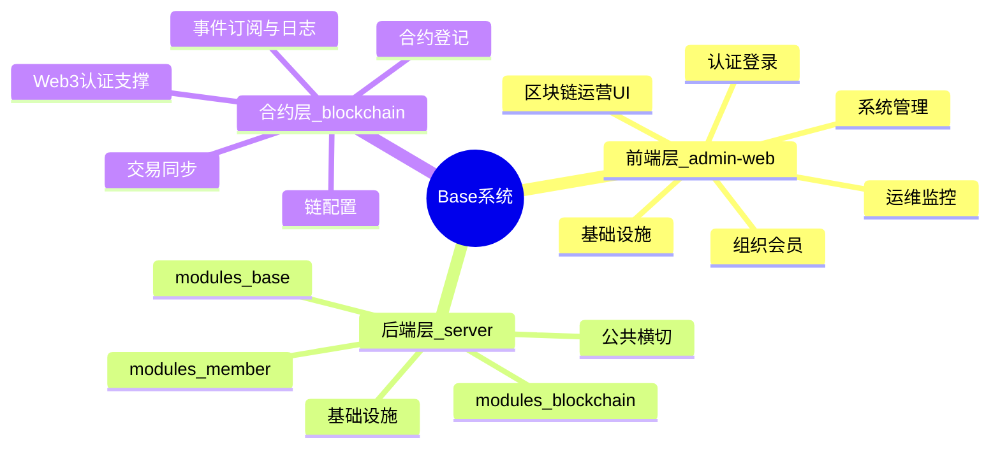
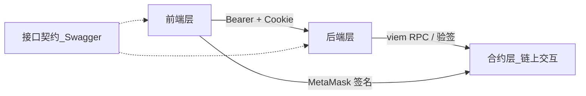

# Base 系统三层架构说明

> 基于当前代码与文档现状（`admin-web/` + `server/`）。  
> 权威文档：[技术方案文档.md](./技术方案文档.md)、[前后端开发规范.md](./前后端开发规范.md)、[区块链系统方案.md](./区块链系统方案.md)。

## 分层定义

| 层级 | 目录 / 范围 | 职责 |
|------|-------------|------|
| **前端层** | `admin-web/` | 管理端 UI、RBAC 按钮、菜单、钱包签名交互 |
| **后端层** | `server/` | 业务逻辑、JWT/RBAC、持久化、RPC 编排 |
| **合约层** | `modules/blockchain/` + 链上交互 | 登记并运营已部署 EVM 合约（无仓库内 Solidity） |

前后端之间的 REST / 权限 / 分页约定属于**接口契约**（见文末附注），不单独占第三层。

---

## 总览思维导图



## 协作关系



| 场景 | 前端层 | 后端层 | 合约层 |
|------|--------|--------|--------|
| 登录 | 密码表单 / MetaMask 签名 | 验密或验签 → JWT + Cookie | 钱包模式走链上签名 |
| 菜单与按钮 | 菜单树 + AuthButton | 按角色过滤 permissionCode | — |
| 合约运营 | 区块链页面 CRUD | 写 `bc_*` 表 + 调 RPC | 读链上事件 / 交易 |
| Token 刷新 | Axios 401 队列重试 | Cookie refresh → 新 access | — |

---

## 1. 前端层（`admin-web/`）

### 技术栈

React 19 · Vite 8 · Ant Design 6 · Zustand 5 · React Router 7 · Axios · viem

### 功能域详情

#### 认证登录

- 路径：`/login`（`pages/login`）
- 模式：`password` / `wallet` / `both`（由站点配置 `loginMode` 控制）
- 能力：密码登录、钱包 nonce 签名、双因子 complete

#### 系统管理

| 路径 | 功能 | 权限码 |
|------|------|--------|
| `/system/user` | 系统用户 CRUD、重置密码、角色分配、钱包绑定 | `user:*` |
| `/system/role` | 角色 CRUD、树形权限分配 | `role:*` |
| `/system/permission` | 权限点 CRUD | `permission:*` |
| `/system/menu` | 菜单路径 / 图标 / 权限码 | `menu:*` |
| `/system/dict` | 字典类型 + 字典数据 | `dict:*` |
| `/system/notice` | 公告草稿 / 发布 / 撤回 | `notice:*` |
| `/system/file` | 文件列表、上传、预览下载 | `file:*` |
| `/system/settings` | 站点名/Logo、登录模式、钱包链 | `setting:*` |

#### 组织与会员

| 路径 | 功能 | 权限码 |
|------|------|--------|
| `/org/department` | 部门树 + 部门用户 | `department:*` |
| `/org/position` | 岗位 CRUD | `position:*` |
| `/member/list` | C 端会员 CRUD、导出 | `member:*` |

#### 运维监控

| 路径 | 功能 | 权限码 |
|------|------|--------|
| `/monitor/operation-log` | 操作日志分页 / 导出 | `log:operation` |
| `/monitor/login-log` | 登录日志 / 导出 | `log:login` |
| `/monitor/protection-log` | 防护 / 钱包安全事件 | `log:protection` |
| `/monitor/online` | 在线用户、强制下线 | `monitor:online` |
| `/monitor/system` | CPU / 内存 / 运行时长 | `monitor:system` |

#### 区块链运营 UI

| 路径 | 功能 | 权限码 |
|------|------|--------|
| `/blockchain/chain` | 链 RPC、探活、启用 | `chain:*` |
| `/blockchain/contract` | 合约 CRUD、同步、Transfer 订阅 | `contract:*` |
| `/blockchain/transaction` | 交易列表、同步、导出 | `tx:*` |
| `/blockchain/event-subscription` | 事件订阅 CRUD、扫描 | `event-sub:*` |
| `/blockchain/event-log` | 链上事件日志、导出 | `event-sub:list` |

#### 个人与工作台

| 路径 | 功能 |
|------|------|
| `/dashboard` | 聚合统计、快捷入口、公告 |
| `/profile` | 昵称、改密码 |
| `/profile/messages` | 个人消息收件箱 |

#### 横切基础设施

- **守卫**：`router/guard.tsx`（校验 accessToken）
- **按钮 RBAC**：`AuthButton permission="user:create"`
- **请求**：`utils/request.ts`（解包 `code===200`、401 刷新、`withCredentials`）
- **Store**：auth / menu / tab / site / message / loading（Zustand）
- **布局**：`BasicLayout`（侧栏菜单后端驱动 + 多标签）

---

## 2. 后端层（`server/`）

### 技术栈

NestJS 10 · TypeORM · MySQL 8 · Redis 7 · JWT 双轨 · Swagger（`/api/docs`）· viem

全局前缀：`/api`。开发环境 `synchronize: true`；生产走 `server/scripts/*.sql`。

### 模块域

```
server/src/modules/
├── base/         # 基础管理（BaseModule）
├── member/       # C 端会员
└── blockchain/   # 区块链运营（合约层实现落点）
```

#### `modules/base/`

| 子模块 | 路径前缀 | 权限 | 能力摘要 |
|--------|----------|------|----------|
| auth | `/api/auth` | Public / 登录 | 密码、钱包、refresh、me、改密 |
| user | `/api/users` | `user:*` | CRUD、重置密码、绑定钱包 |
| role | `/api/roles` | `role:*` | CRUD + `POST :id/permissions` |
| permission | `/api/permissions` | `permission:*` | 权限点 CRUD |
| menu | `/api/menus` | `menu:*` | 树 / CRUD |
| department | `/api/departments` | `department:*` | 树 / CRUD |
| position | `/api/positions` | `position:*` | CRUD |
| dict | `/api/dict` | `dict:*` | 类型 + 数据 |
| notice | `/api/notices` | `notice:*` | 发布投递 / 撤回 |
| message | `/api/messages` | 登录即可 | 未读数 / 收件箱 / 已读 |
| file | `/api/files` | `file:*` | 上传 / 下载 / 列表 |
| setting | `/api/settings` | `setting:*` / Public | 站点、品牌、可用链 |
| log | `/api/logs` | `log:*` | 操作 / 登录 / 防护 + 导出 |
| monitor | `/api/monitor` | `monitor:*` | 在线用户 / 系统状态 |
| dashboard | `/api/dashboard` | 登录 | overview 聚合 |
| health | `/api/health` | Public | MySQL + Redis |
| seed | — | — | RBAC / 菜单 / admin 种子 |

#### `modules/member/`

| 端点 | 权限 | 说明 |
|------|------|------|
| `/api/members` | `member:*` | 管理端会员 CRUD、导出、重置密码 |
| `/api/app/auth` | Public / MemberJwt | C 端注册、登录、refresh、资料 |

会员表 `app_member`，与 `sys_user` 无关联，不参与后台 RBAC。

#### 公共横切

| 机制 | 说明 |
|------|------|
| 守卫链 | `ThrottlerGuard` → `JwtAuthGuard` → `PermissionsGuard` |
| 响应包装 | `{ code, message, data, timestamp }`；`@SkipWrap` 用于导出/下载 |
| 异常 | HTTP 状态码与 body `code` 一致；业务子码 `errorCode` |
| 操作日志 | 非 GET 已认证写操作自动记 `sys_operation_log` |
| 基类实体 | `id` / `createdAt` / `updatedAt` / `deletedAt` 软删 |
| JWT 双轨 | admin `type: admin`；member `type: member` |

### 权限码（种子摘要）

格式：`{模块}:{操作}`。种子：`server/src/modules/base/seed/rbac-seed.service.ts`。

- 用户：`user:list/create/update/delete/reset-password/bind-wallet`
- 角色：`role:list/create/update/delete/assign-permission`
- 权限 / 菜单 / 部门 / 岗位 / 字典 / 公告：各 `*:list/create/update/delete`
- 日志：`log:operation/login/protection`
- 监控：`monitor:online/system`
- 文件：`file:list/upload/download/delete`
- 设置：`setting:list/update`
- 会员：`member:list/create/update/delete/reset-password`
- 区块链：`chain:*`、`contract:*`、`tx:list/create`、`event-sub:*`

默认管理员：`admin` / `Admin@123`。

---

## 3. 合约层（区块链能力）

### 定位

- **不是** Solidity 源码仓库或链上部署工具。
- **是** 已部署 EVM 合约的元数据登记 + viem RPC / 事件同步运营能力。
- 代码落点：`server/src/modules/blockchain/`、`admin-web/src/pages/blockchain/`。

### 能力树

#### 链配置（`bc_chain`）

- RPC URLs、探活 `health`、`loginEnabled`、启用开关
- API：`/api/blockchain/chains`（权限 `chain:*`）
- Public：`/enabled`、登录可用链（站点设置联动）

#### 合约登记（`bc_contract`）

- 地址、ABI、合约类型、状态
- CRUD；`listen-options`；`subscribe-transfer`；`sync-transactions`
- 权限：`contract:*`

#### 交易（`bc_transaction`）

- 录入、列表、按合约同步、CSV 导出
- 权限：`tx:list` / `tx:create`

#### 事件订阅与日志

| 实体 | 能力 |
|------|------|
| `bc_event_subscription` | CRUD + `POST :id/scan` 手动扫描 |
| `bc_event_log` | 查询、导出 |
| 后台服务 | `EventSyncService`、`TransactionService`、`ContractTxSyncService`、`BlockchainRpcService` |

权限：`event-sub:*`（日志读用 `event-sub:list`）

#### Web3 认证支撑

- `WalletAuthService`：nonce（Redis TTL）+ viem 验签
- 与站点 `loginMode`（password / wallet / both）联动
- 验签失败等写入防护日志 `ProtectionLog`

### 合约层 API 速查

| 资源 | 端点 | 权限 |
|------|------|------|
| 链 | `/api/blockchain/chains` | `chain:*` |
| 合约 | `/api/blockchain/contracts` | `contract:*` |
| 交易 | `/api/blockchain/transactions` | `tx:*` |
| 事件订阅 | `/api/blockchain/event-subscriptions` | `event-sub:*` |
| 事件日志 | `/api/blockchain/event-logs` | `event-sub:list` |

---

## 附注：跨层接口契约

| 约定 | 内容 |
|------|------|
| Base URL | `/api` |
| Access Token | `Authorization: Bearer <accessToken>`（前端 sessionStorage） |
| Refresh Token | HttpOnly Cookie；前端 `withCredentials: true` |
| 成功响应 | `{ code: 200, message, data, timestamp }` |
| 失败响应 | HTTP 状态码 = body `code`；可选 `errorCode` / `detail` |
| 分页 | `page`（从 1）、`pageSize`（≤100）；`data: { items, total, page, pageSize }` |
| 权限码 | `{模块}:{操作}`；后端 `@RequirePermissions` ↔ 前端 `AuthButton` |
| JSON 字段 | camelCase |

实现对照：`server/src/modules/**/dto/` ↔ `admin-web/src/api/*.ts`；运行时文档 `http://localhost:3000/api/docs`。
